# Deployment Workflow (Local -> Staging -> Prod)

```mermaid
flowchart LR
    LocalDev["Local Dev"] -->|"git push"| MainBranch["main branch"]
    MainBranch -->|"deploy_staging.ps1"| StagingDeploy["Staging App deploy"]
    StagingDeploy -->|"smoke_test.py (staging)"| StagingGate["staging_passed_<sha>.json"]
    StagingGate -->|"deploy_prod.ps1"| ProdDeploy["Prod App deploy"]
    ProdDeploy -->|"smoke_test.py --read-only"| ProdVerify["Prod verified"]
```



## Guardrails

- No big-bang deploy:
  - Phase A: deploy `db.py` refactor first (no `app.yaml` change)
  - Phase B: deploy `app.yaml` runtime branching by `DATABRICKS_APP_NAME`, redeploy
- Staging and prod share host/endpoint, so `PGDATABASE` is the isolation boundary.
- Collision guard in `db.py` blocks staging from using `databricks_postgres`.
- Prod deploy requires matching staging pass artifact for same commit SHA.
- `app.yaml` runtime branching is authoritative for env targeting:
  - `hertz-leo-lms-staging` -> `APP_TIER=staging`, `PGDATABASE=lms_staging`
  - `hertz-leo-leadsmgmtsystem` -> `APP_TIER=prod`, `PGDATABASE=databricks_postgres`

## Staging deploy

```powershell
./scripts/deploy_staging.ps1 -BaseUrl https://<staging-app-url>
```

Runs:

1. `npm run build`
2. `python -m compileall .`
   - If Windows reports transient permission errors under `.tmp-localappdata/...`, use scoped compile instead:
   - `python -m compileall db.py main.py routers services scripts etl`
3. `python scripts/check_schema_drift.py --target staging`
4. `git push`
5. `databricks repos update ...`
6. `databricks apps deploy hertz-leo-lms-staging ...`
7. `python scripts/smoke_test.py --target staging ...`
8. Write `release/staging_passed_<sha>.json`

## Prod deploy

```powershell
./scripts/deploy_prod.ps1 -BaseUrl https://<prod-app-url>
```

Runs:

1. Validate staging gate artifact for current SHA
2. Operator confirmation (`PROD`)
3. `npm run build`
4. `python -m compileall .`
5. `python scripts/check_schema_drift.py --target prod`
6. `git push`
7. `databricks repos update ...`
8. `databricks apps deploy hertz-leo-leadsmgmtsystem ...`
9. `python scripts/smoke_test.py --target prod --read-only ...`

## Related docs

- `docs/LOCAL-DEV-SETUP.md` (local build + validation)
- `docs/LOCAL-RESET-RUNBOOK.md` (clean reset procedure)

## Migration governance

- Promotion order is strict: local -> staging -> prod.
- Migration rollback is forward-fix only.
- Never run destructive manual schema operations in prod.
