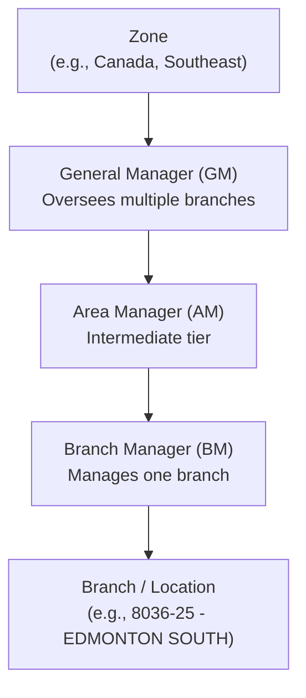
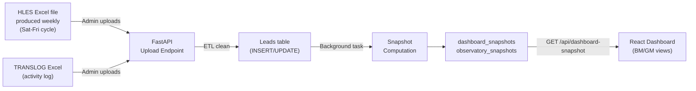

# Business Context & Domain Glossary

## 1. Executive Summary

**LEO** is the Hertz Lead Management System — an internal web application that helps Hertz insurance replacement branch managers (BMs) and general managers (GMs) track, enrich, and review lead conversion activity.

Insurance replacement (IR) is one of Hertz's most valuable business lines. When a customer has a car accident, their insurance company authorises a rental car via EDI (Electronic Data Interchange), creating a **lead** in Hertz's mainframe system (HLES). The branch must then contact the customer, arrange pickup, and convert the lead into a rental.

LEO replaces a manual process where BMs tracked leads in personal Excel spreadsheets — with no upward visibility, no accountability loop, and no centralised history of follow-up activity.

---

## 2. The Business Problem

Before LEO, three critical problems existed:

1. **No upward visibility** — GMs had no way to see whether BMs were actively working their leads. There was no incentive structure and no consequence for neglecting follow-ups.

2. **No accountability loop** — HLES tracks reservations but not the quality or frequency of activity against them. There was no compliance mechanism to ensure BMs were enriching cancelled/unused leads with reasons and notes.

3. **Manual enrichment was painful and lost** — Weekly compliance meetings required BMs to manually filter messy HLES Excel exports, enrich each non-converted lead with notes, and present them to the GM. This was time-consuming for non-tech-savvy users, and all feedback captured in meetings was never centralised.

**The result:** cancelled leads were written off without investigation, potential revenue was lost in leads that were never properly worked, and there was no data to drive improvement.

---

## 3. User Roles & Personas

### Branch Manager (BM)

- **Who:** Manages a single Hertz branch/location. Not tech-savvy — lives in HLES and Excel.
- **Daily workflow in LEO:**
  1. Opens Summary dashboard — sees conversion rate, compliance status, open tasks
  2. Goes to Lead Queue — reviews cancelled/unused leads needing enrichment
  3. Adds comments (reason for cancellation, notes, next action) to each lead
  4. Logs first contact attempts (branch, HRD, or none)
  5. Completes assigned tasks from GM
  6. Prepares for weekly meeting via Meeting Prep view

### General Manager (GM)

- **Who:** Oversees multiple branches across a zone. Responsible for conversion performance.
- **Daily workflow in LEO:**
  1. Opens Overview dashboard — sees zone-wide metrics across all branches
  2. Reviews cancelled leads for mismatches (HLES says one thing, TRANSLOG says another)
  3. Issues directives to branches needing attention
  4. Monitors compliance trends — which branches are falling behind
  5. Uses Meeting Prep for structured weekly reviews with BMs
  6. Checks Activity Report to see BM engagement levels
  7. Uses Observatory for deep conversion analysis

### Admin

- **Who:** Data/ops team member responsible for system administration.
- **Workflow in LEO:**
  1. Uploads weekly HLES and TRANSLOG Excel data files
  2. Monitors ingestion status (success/failure, row counts)
  3. Manages org mapping (BM-to-Branch-to-AM-to-GM-to-Zone hierarchy)

---

## 4. Organizational Hierarchy

This hierarchy is stored in the `org_mapping` table and determines:
- Which leads a BM can see (their branch only)
- Which branches a GM can see (all branches under them via org_mapping)
- How metrics are aggregated (branch → zone)

---

## 5. Weekly Data Cycle

### The cycle:
1. **Weekly:** HLES produces an Excel export of all IR reservations (typically Saturday-to-Friday)
2. **Admin uploads** the file via LEO's Admin > Upload view
3. **ETL cleans** the data: normalises column names, maps to DB schema, deduplicates on `confirm_num`
4. **Leads are inserted/updated** in the database (new leads = INSERT, existing = UPDATE on `confirm_num`)
5. **Background tasks** trigger automatically: snapshot computation, observatory computation, days_open refresh
6. **Dashboards refresh** — BMs and GMs see updated metrics

---

## 6. Domain Glossary

| Term | Definition | Where Used |
|------|------------|------------|
| **HLES** | Hertz Liability and Equipment System — the mainframe that manages all IR reservations and contracts. Source of truth for lead status. | Data source (Excel uploads) |
| **TRANSLOG** | Transaction log in HLES — records every action taken on every reservation/contract (calls, notes, events). | Data source (Excel uploads) |
| **HRD** | Hertz Replacement Desk — centralised outbound call centre in Oklahoma City that contacts customers on behalf of branches. | Contact tracking |
| **EDI** | Electronic Data Interchange — electronic channel through which insurance partners send and cancel reservations. | Lead creation |
| **Lead** | An insurance replacement reservation received via EDI. Identified by `confirm_num`. | Core entity |
| **Confirm Num** | Confirmation number (e.g., "208-9441926") — the unique business identifier for each lead/reservation. | Primary key for leads |
| **CDP / CDP Name** | Insurance company identifier and name (e.g., "COOPERATORS (CGIC) HIRS"). | Lead attribute |
| **RENT_IND** | Rental indicator: 1 = converted (rented), 0 = not converted. | Status derivation |
| **CANCEL_ID** | Cancellation indicator: 1 = cancelled. | Status derivation |
| **UNUSED_IND** | Unused indicator: 1 = still open/expired. | Status derivation |
| **Lead Statuses** | **Rented** (converted), **Cancelled** (lost), **Unused** (open/expired), **Reviewed** (GM has reviewed). | Throughout app |
| **Enrichment / Comments** | Notes and structured reasons a BM adds to explain why a lead didn't convert. Users call these "comments" — code uses "enrichment" internally. | BM lead workflow |
| **W30** | "Within 30 minutes" — % of eligible leads contacted within 30 minutes of creation. The #1 GM metric. | GM dashboard |
| **Contact Range** | Time bucket for first contact (e.g., "(a)<30min", "(c)1-3 hrs", "NO CONTACT"). From HLES. | Lead attribute |
| **Contact Group** | Who made first contact: "COUNTER" (branch) or "HRD" (call centre). | Lead attribute |
| **First Contact By** | LEO's normalised version: `branch`, `hrd`, or `none`. | Lead attribute |
| **KNum** | K-number — changes from reservation format to contract format when a lead converts to rental. | Lead attribute |
| **Body Shop** | The body shop handling the vehicle repair. | Lead attribute |
| **Mismatch** | When HLES data and TRANSLOG data tell different stories about a lead (e.g., HLES says "cancelled" but TRANSLOG shows active contact). Visually flagged for GM review. | GM review workflow |
| **Directive** | A GM-issued instruction for a specific lead — action items for the branch (e.g., "Follow up with customer", "Investigate cancellation"). | GM → BM workflow |
| **Observatory** | Analytics module for deep conversion analysis across branches, zones, and time periods. | Shared analytics view |
| **HLES Week** | Saturday-to-Friday calendar week. Monday belongs to the Saturday that starts that week. | Date logic throughout |
| **Trailing 4 Weeks (T4W)** | The default time window: the most recent 4 complete HLES weeks. | Dashboard default |
| **init_dt_final** | The date the reservation was received — primary date field for all time-based filtering. | Date logic |
| **week_of** | The HLES week bucket date — which Saturday-to-Friday week the lead belongs to. | Date grouping |
| **MMR** | Manage My Reservation — digital self-service flow where customers confirm reservation details. | Lead journey context |

---

## 7. Key Metrics

### BM Summary Metrics

| Metric | Definition | Business Meaning |
|--------|-----------|-----------------|
| **Total Leads** | Count of all leads (Cancelled + Unused + Rented) | Volume of business activity for the branch |
| **Conversion Rate %** | Rented leads / Total leads | Core performance indicator — target is 80%+ |
| **Comment Compliance %** | Enriched actionable leads / Total actionable leads | Are BMs doing their compliance work? |
| **Open Tasks** | Tasks not yet completed | Outstanding work items |
| **Task Completion Rate %** | Completed tasks / All tasks | BM engagement and follow-through |
| **Avg Time to First Contact** | Average MIN_DIF across leads with contact | Speed of initial customer outreach |

### GM Summary Metrics

| Metric | Definition | Business Meaning |
|--------|-----------|-----------------|
| **Conversion Rate %** | Rented leads / Total leads (across zone) | Zone-wide performance |
| **Contacted < 30 Min (W30) %** | Leads contacted within 30 min / Eligible leads | The #1 metric — "My number one question is always what percentage are we contacting within thirty minutes" |
| **Comment Compliance %** | Enriched actionable leads / Total actionable leads | Are BMs across the zone doing their work? |
| **Branch Contact %** | Leads contacted by branch (COUNTER) / Total leads | Branch vs HRD contact split — if HRD is contacting your leads, your branch isn't doing its job |
| **Cancelled Unreviewed** | Cancelled leads without GM directive | How many cancelled leads has the GM not yet investigated? |
| **No Contact Attempt** | Actionable leads with no contact at all | Most concerning — leads that were completely ignored |

---

## 8. Data Sources

### HLES Excel File

- **Produced by:** Hertz's HLES mainframe system
- **Frequency:** Weekly (Saturday-to-Friday cycle)
- **Contents:** One row per reservation — confirmation number, customer info, branch, insurance company, status flags (RENT_IND, CANCEL_ID, UNUSED_IND), contact information, dates, org hierarchy
- **Key columns:** CONFIRM_NUM, CDP_NAME, RENT_LOC, RENT_IND, CANCEL_ID, UNUSED_IND, CONTACT_RANGE, INIT_DT_FINAL, WEEK_OF, GENERAL_MGR, AREA_MGR, ZONE
- **Quirk:** Column headers have leading `\n` characters from Excel formatting — the ETL strips these during normalisation

### TRANSLOG Excel File

- **Produced by:** HLES transaction log
- **Frequency:** Uploaded alongside or after HLES
- **Contents:** Activity trail for each reservation — every call, note, system event, status change
- **Purpose:** Provides the "what actually happened" view that can be compared against HLES status for mismatch detection

---

## 9. The HLES Week Convention

All date-based logic in LEO uses the **Saturday-to-Friday** HLES week:

- A week starts on **Saturday** and ends on **Friday**
- Monday March 2 belongs to the week starting Saturday February 28
- The "Trailing 4 Weeks" (T4W) default view shows the most recent 4 complete HLES weeks
- `init_dt_final` (reservation received date) is the primary date field for filtering
- `week_of` is the HLES week bucket — which Sat-Fri week the lead belongs to

This convention matches how HLES produces its weekly exports and is critical to understanding all metric calculations and date range displays in the application.
