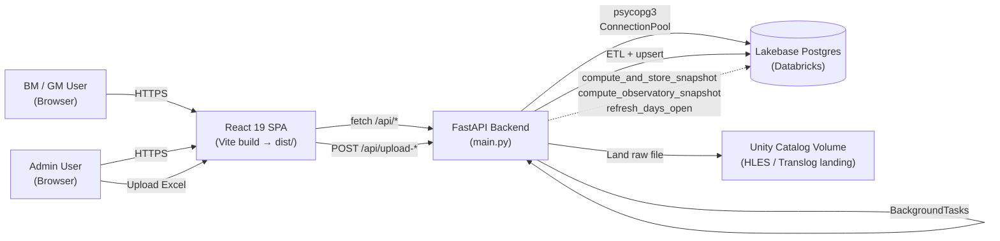
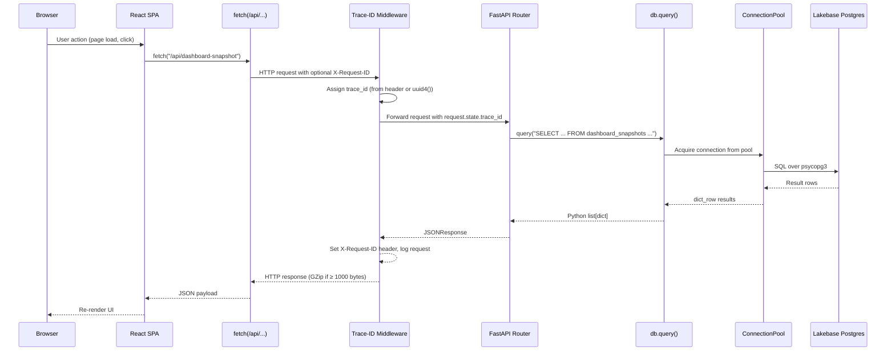
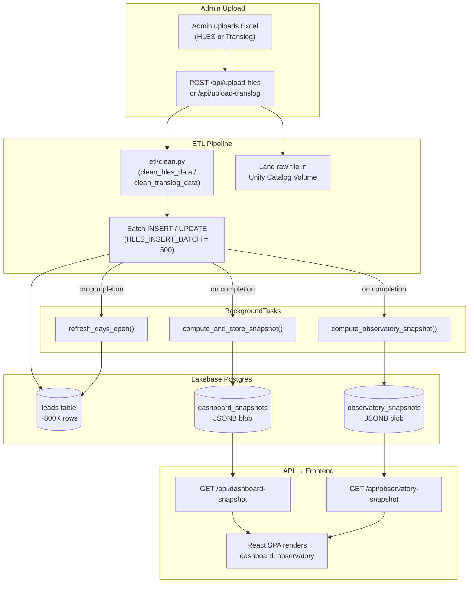

# 02 — Technical Architecture

> LEO (Lead Enrichment & Operations) platform — handover technical reference.
>
> Cross-references: [01 — Business Context & Glossary](01-business-context-glossary.md) for domain terms, [03 — Infrastructure & Deployment](03-infrastructure-deployment.md) for runtime environment, [05 — Database Diagrams](05-database-diagrams.md) for full schema.

---

## 1. Architecture Overview

LEO is a single-page web application backed by a Python API that helps Hertz branch managers (BMs) and general managers (GMs) track lead conversion, task compliance, and team performance. The frontend is a React 19 SPA served by the same process that hosts the API, so there is no separate web server or reverse proxy to manage. Users authenticate via token-based auth, and all data flows through a single FastAPI backend into a Lakebase Postgres database hosted on Databricks.

The data lifecycle begins when an administrator uploads an Excel spreadsheet (HLES or Translog export). The backend cleans and upserts the data into Postgres, then triggers a chain of background computations — dashboard snapshots, observatory snapshots, and days-open recalculations — that pre-aggregate metrics into JSONB blobs. The frontend never queries raw lead rows for dashboard rendering; instead, it fetches a single pre-computed snapshot row that contains every metric, trend, and drill-down payload the UI needs.

This architecture was chosen deliberately. With roughly 800,000 lead records in the database, computing conversion rates, compliance percentages, and weighted zone averages on every page load would be prohibitively slow. Pre-computing snapshots after each upload shifts the cost to a background task that runs once per data refresh (typically weekly), while reads remain sub-second. The trade-off is that dashboard data is only as fresh as the last upload — which aligns with the weekly HLES cadence described in [01 — Business Context & Glossary](01-business-context-glossary.md).

---

## 2. System Context Diagram



---

## 3. Frontend Architecture

### Stack

| Concern | Technology |
|---|---|
| Framework | React 19 |
| Routing | React Router v7 (`createBrowserRouter`) |
| State management | React Context API (no Redux) |
| Build tool | Vite |
| Code splitting | `lazyWithRetry` (dynamic `import()` with retry-on-failure) |
| Animation | Framer Motion |
| Testing | Playwright (E2E), Vitest (unit) |

### Context Providers

Three nested contexts wrap the authenticated portion of the app:

| Context | File | Responsibility |
|---|---|---|
| **AuthContext** | `src/context/AuthContext.jsx` | Token storage (sessionStorage), sign-in / sign-out, user profile fetching, onboarding state |
| **AppContext** | `src/context/AppContext.jsx` | Current role (`bm` / `gm` / `admin`), mode (`interactive` / `presentation`), sidebar state |
| **DataContext** | `src/context/DataContext.jsx` | All data fetching — stale-while-revalidate from sessionStorage cache, API calls via `src/data/databricksData.js`, exposes leads, tasks, config, snapshots, org mapping |

### Selectors Layer

Metric computations (conversion rate, W30, compliance, etc.) are implemented in `src/selectors/demoSelectors.js`. These pure functions accept raw lead/task arrays and return derived values. The snapshot service (`services/snapshot.py`) mirrors the same formulas server-side so that pre-computed JSONB blobs match what the frontend would calculate from raw data.

### Component Hierarchy

```
<RouterProvider>
  └─ <AuthenticatedLayout>        ← AuthGuard + AppLayout wrapper
       ├─ <Sidebar />             ← role-aware navigation
       └─ <Outlet />              ← lazy-loaded page component
            └─ <Suspense fallback={<LoadingScreen />}>
                 └─ <PageComponent />
```

### Route Map

Routes are role-prefixed. The `AppViewRoute` wrapper sets mode and role on mount.

| Prefix | Routes | Audience |
|---|---|---|
| `/bm/*` | summary, work, leads, leads/:id, tasks, tasks/:id, meeting-prep, leaderboard | Branch Managers |
| `/gm/*` | overview, work, meeting-prep, meeting-prep/all, activity-report, leaderboard, leads, leads/:id, tasks/:id | General Managers |
| `/admin/*` | dashboard, uploads, org-mapping, legend | Administrators |
| `/observatory/*` | landing, conversion, leads, leaderboard | All roles |
| `/` | Redirect to role home (`/bm/summary`, `/gm/overview`, or `/admin`) | — |
| `/login` | Login screen | Unauthenticated |
| `/profile` | User profile | All roles |
| `/feedback` | Feedback form | All roles |

---

## 4. Backend Architecture

### Application Entry Point — `main.py`

The FastAPI app is defined in `main.py` with the title `"Hertz LMS API"`. It performs the following on startup:

1. **Middleware registration** — GZip compression (minimum 1000 bytes) and a custom trace-ID middleware that reads or generates a UUID via the `X-Request-ID` header.
2. **Exception handlers** — Three handlers produce a consistent JSON error envelope (`{ error: { code, message, traceId, retryable } }`) for `HTTPException`, `RequestValidationError`, and unhandled `Exception`.
3. **Connection pool warmup** — `_ensure_pool().wait()` eagerly opens database connections so background tasks do not block on first use.
4. **Router mounting** — 10 API routers are included under the `/api` prefix.
5. **Static file serving** — Vite build output (`dist/assets/`) is mounted, and a catch-all SPA fallback serves `dist/index.html` with `Cache-Control: no-cache` for any non-API, non-asset path.

### Middleware Stack (order of execution)

```
Request
  → GZipMiddleware (compress responses ≥ 1000 bytes)
  → add_trace_id (assign/propagate X-Request-ID, log request line)
  → Router handler
  → Exception handlers (if error)
Response
```

### Database Module — `db.py`

- Uses **psycopg 3** with `psycopg_pool.ConnectionPool` for connection management.
- Returns `dict_row` results (every row is a Python dict).
- Supports two runtime modes: `APP_ENV=local` (direct password auth) and `APP_ENV=databricks` (OAuth per-connection via Databricks SDK).
- Validates at startup that `APP_ENV=local` is never pointed at a Databricks host (safety guard).
- Exposes `query()`, `execute()`, and `with_connection()` context manager.

### Health Endpoint

`GET /api/health/runtime` — returns `{ env, tier, host, db }`. Protected by JWT in staging/prod, open in local.

---

## 5. API Endpoint Table

All routers are mounted at `/api`. Key endpoints for each:

| Router file | Prefix / Tag | Key Endpoints | Methods | Purpose |
|---|---|---|---|---|
| `auth.py` | `/api` | `/auth/login`, `/auth/profile`, `/auth/profile/update` | POST, GET, PUT | Token issuance, profile fetch, onboarding |
| `leads.py` | `/api` | `/leads`, `/leads/:id`, `/leads/:id/enrichment`, `/leads/:id/contact`, `/leads/:id/directive`, `/leads/:id/reviewed` | GET, PUT | Lead list (paginated), detail, enrichment updates |
| `tasks.py` | `/api` | `/tasks`, `/tasks/:id`, `/tasks/gm`, `/tasks/gm/page` | GET, PUT | Task list, detail, GM-scoped task queries |
| `config.py` | `/api` | `/config`, `/org-mapping`, `/branch-managers` | GET | App configuration, org mapping, BM list |
| `upload.py` | `/api` | `/upload-hles`, `/upload-translog`, `/upload-summary` | POST, GET | Excel upload, ETL trigger, upload history |
| `directives.py` | `/api` | `/directives`, `/directives/gm` | GET, POST | GM directives per lead |
| `wins.py` | `/api` | `/wins` | GET, POST | Wins & learnings entries |
| `snapshot.py` | `/api` | `/dashboard-snapshot` | GET | Serve latest pre-computed dashboard snapshot |
| `observatory.py` | `/api` | `/observatory-snapshot` | GET | Serve latest observatory (zone-level) snapshot |
| `feedback.py` | `/api` | `/feedback` | POST | User feedback submission |

---

## 6. Request Flow Sequence Diagram



---

## 7. Data Flow Diagram



---

## 8. Snapshot Architecture

### Why Snapshots?

The `leads` table contains approximately 800,000 rows. Computing trailing-4-week conversion rates, weighted zone averages, compliance percentages, task completion rates, and change-vs-prior-period deltas across all branches on every page load is not feasible at interactive latency. Instead, LEO pre-computes these metrics once per data upload and stores the result as a single JSONB row.

### How It Works

1. **Trigger** — After each HLES upload completes its INSERT/UPDATE batch, the upload router adds three `BackgroundTasks`:
   - `compute_and_store_snapshot()` — dashboard metrics for BM and GM views
   - `compute_observatory_snapshot()` — zone-level cross-branch comparison
   - `refresh_days_open()` — recalculate days-open for open leads
2. **Computation** — `services/snapshot.py` reads all leads, org mapping, and tasks from Postgres. It mirrors the JavaScript selector logic (`src/selectors/demoSelectors.js`) server-side: Saturday-Friday week bucketing, trailing-4-week and comparison-4-week windows, per-branch and per-zone aggregations.
3. **Storage** — The result is a nested Python dict serialized to JSONB and inserted into `dashboard_snapshots` with a timestamp. See [05 — Database Diagrams](05-database-diagrams.md) for the table schema.
4. **Serving** — `GET /api/dashboard-snapshot` returns the latest row. The frontend's `DataContext` caches this in sessionStorage (stale-while-revalidate) and passes it to components.

### Snapshot Contents (high-level)

The JSONB blob contains:

- **Period metadata** — `period` and `comparison` date ranges (T4W and prior T4W)
- **Per-branch metrics** — conversion rate, W30, comment compliance, branch contact rate, cancelled-unreviewed count, no-contact-attempt count, open tasks, task completion rate, average time to contact
- **Per-zone weighted averages** — aggregated from raw counts (not averaged branch rates)
- **Change tags** — absolute deltas and directional indicators (up/down/flat) vs. prior period
- **Drill-down payloads** — lead lists backing each metric for modal detail views

---

## 9. Design Decisions & Rationale

| Decision | Rationale |
|---|---|
| **JSONB for snapshot storage** | Dashboard snapshots are deeply nested (per-branch, per-zone, drill-down arrays). JSONB allows storing the entire payload as a single row without a complex relational schema, and Postgres can still index and query within the JSON if needed. |
| **`confirm_num` as business key** | Leads are identified by confirmation number, not `reservation_id`. A single reservation can generate multiple confirm numbers over its lifecycle. The HLES source data is keyed on `confirm_num`, making it the natural deduplication and upsert key. See [01 — Business Context & Glossary](01-business-context-glossary.md). |
| **Saturday-Friday weeks** | HLES reporting weeks run Saturday through Friday, matching the Hertz operational calendar. All date bucketing in both the Python snapshot service and JavaScript selectors follows this convention. |
| **OAuth per-connection (Databricks)** | When `APP_ENV=databricks`, each connection from the pool authenticates via Databricks OAuth rather than a static password. This avoids storing long-lived database credentials and integrates with Databricks workspace identity. |
| **No ORM — raw SQL via psycopg3** | The query patterns are straightforward (batch upserts, filtered selects, single-row reads). An ORM would add abstraction overhead without meaningful benefit. Raw SQL keeps queries auditable and makes Postgres-specific features (JSONB, `ON CONFLICT`, `unnest`) easy to use. |
| **Context API over Redux** | The app has three well-scoped data domains (auth, app state, data) that map naturally to React Context providers. There is no cross-cutting state that would benefit from Redux's global store or middleware. Context keeps the dependency graph simple and avoids additional bundle size. |
| **Stale-while-revalidate in DataContext** | On mount, `DataContext` shows cached data from sessionStorage immediately while fetching fresh data in the background. This eliminates loading spinners on repeat visits and makes the app feel instant. |
| **`lazyWithRetry` for code splitting** | All page-level components are loaded via dynamic `import()` wrapped in a retry helper. This reduces the initial bundle size and gracefully handles transient network failures during chunk loading. |
| **Single-process SPA serving** | FastAPI serves the Vite build output (`dist/`) directly via `StaticFiles` and a catch-all fallback route. This eliminates the need for a separate Nginx or CDN layer in the Databricks Apps deployment model. |
| **Structured error envelope** | Every API error returns `{ error: { code, message, traceId, retryable } }`. The `traceId` enables log correlation, `code` enables programmatic handling (e.g., `TOKEN_EXPIRED` triggers re-auth), and `retryable` tells the frontend whether to retry automatically. |

---

*Next: [03 — Infrastructure & Deployment](03-infrastructure-deployment.md)*
