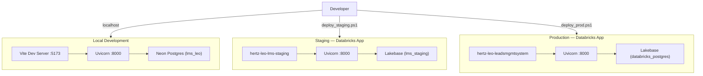
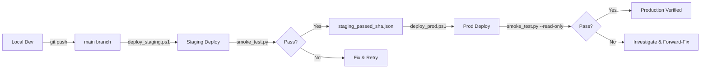
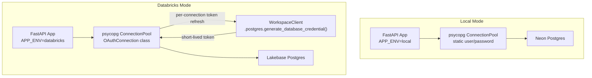

# 03 — Infrastructure & Deployment Pipeline

> **LEO Handover Series** | See also:
> [02-technical-architecture.md](02-technical-architecture.md),
> [08-operational-runbook.md](08-operational-runbook.md),
> [09-security-access-control.md](09-security-access-control.md)

---

## 1. Environment Topology

LEO operates across three environments — Local, Staging, and Production — all running the same codebase. Environment identity is resolved at startup via two variables: `APP_ENV` (runtime mode) and `APP_TIER` (isolation boundary). Local development connects to a Neon-hosted Postgres instance with static credentials. Staging and Production both run as Databricks Apps on the same Databricks workspace, sharing a single Lakebase endpoint but isolated by database name (`PGDATABASE`). The `app.yaml` entrypoint uses the Databricks-injected `DATABRICKS_APP_NAME` to set all environment variables deterministically, making it impossible for a deployed app to target the wrong tier.



---

## 2. Environment Details

| Environment | `APP_ENV` | `APP_TIER` | `PGDATABASE` | Databricks App Name | URL Pattern |
|---|---|---|---|---|---|
| Local | `local` | `local` | User-configured (e.g. `lms_leo`) | N/A | `localhost:5173` (Vite) / `localhost:8000` (API) |
| Staging | `databricks` | `staging` | `lms_staging` | `hertz-leo-lms-staging` | `https://hertz-leo-lms-staging-<workspace>.databricksapps.com` |
| Production | `databricks` | `prod` | `databricks_postgres` | `hertz-leo-leadsmgmtsystem` | `https://hertz-leo-leadsmgmtsystem-<workspace>.databricksapps.com` |

---

## 3. Databricks Apps Deployment (`app.yaml`)

The `app.yaml` at repository root is the single entrypoint for all deployed environments. Databricks injects `DATABRICKS_APP_NAME` into the container at runtime; the shell `case` statement resolves the full set of environment variables:

```yaml
command:
  - sh
  - -c
  - |
    set -eu
    case "${DATABRICKS_APP_NAME:-}" in
      hertz-leo-lms-staging)
        export APP_ENV=databricks
        export APP_TIER=staging
        export PGDATABASE=lms_staging
        ;;
      hertz-leo-leadsmgmtsystem)
        export APP_ENV=databricks
        export APP_TIER=prod
        export PGDATABASE=databricks_postgres
        ;;
      *)
        echo "Unknown DATABRICKS_APP_NAME; refusing to start."
        exit 1
        ;;
    esac
    pip install -r requirements.txt
    uvicorn main:app --host 0.0.0.0 --port 8000
env:
  - name: ENDPOINT_NAME
    value: "projects/lms-leo/branches/production/endpoints/primary"
```

Key points:

- **Unknown app names cause hard failure** — the wildcard `*)` case exits with code 1, preventing accidental deployment under an unrecognized name.
- **`ENDPOINT_NAME`** is set statically in the `env` block: `projects/lms-leo/branches/production/endpoints/primary`. Both staging and production share this Lakebase endpoint; isolation is via `PGDATABASE`.
- Dependencies are installed at container start (`pip install -r requirements.txt`), then `uvicorn` launches the FastAPI app on port 8000.

---

## 4. Deployment Pipeline Flowchart



The pipeline enforces **staging-before-prod** via a gate artifact: `release/staging_passed_<sha>.json`. The production deploy script will refuse to proceed unless this file exists for the current commit SHA.

---

## 5. Staging Deploy Steps

Script: `scripts/deploy_staging.ps1`

```powershell
./scripts/deploy_staging.ps1 -BaseUrl https://<staging-app-url>
```

| Step | Command | Purpose |
|---:|---|---|
| 1 | `npm run build` | Build React/Vite frontend into `dist/` |
| 2 | `python -m compileall .` | Compile all `.py` files; catches syntax errors before deploy |
| 3 | `python scripts/check_schema_drift.py --target staging` | Validates staging DB schema matches expected migration state |
| 4 | `git push origin main` | Push latest code to remote |
| 5 | `databricks repos update <RepoId> --branch main` | Sync the Databricks Workspace Repo to the pushed commit |
| 6 | `databricks apps deploy hertz-leo-lms-staging --source-code-path <path>` | Deploy the Databricks App from the synced Workspace Repo |
| 7 | `python scripts/smoke_test.py --target staging --base-url <url>` | Run smoke tests against the deployed staging app |

On success, the smoke test writes `release/staging_passed_<sha>.json` as the gate artifact for the production deploy.

Default parameters (overridable):
- `$Profile` = `DanSiaoAuth` (Databricks CLI auth profile)
- `$RepoId` = `3281422440033516`
- `$SourceCodePath` = `/Workspace/Repos/nh136948@hertz.net/Prototype-LMS-Databricks`

---

## 6. Production Deploy Steps

Script: `scripts/deploy_prod.ps1`

```powershell
./scripts/deploy_prod.ps1 -BaseUrl https://<prod-app-url>
```

| Step | Command | Purpose |
|---:|---|---|
| 1 | Check `release/staging_passed_<sha>.json` | **Gate check** — aborts if staging has not passed for this exact commit |
| 2 | Operator types `PROD` | Interactive confirmation to prevent accidental deploys |
| 3 | `npm run build` | Rebuild frontend |
| 4 | `python -m compileall .` | Compile Python |
| 5 | `python scripts/check_schema_drift.py --target prod` | Validate prod DB schema |
| 6 | `python scripts/compare_migration_state.py` | Compare staging and prod migration ledgers — ensures prod is not behind staging |
| 7 | `git push origin main` | Push to remote |
| 8 | `databricks repos update <RepoId> --branch main` | Sync Workspace Repo |
| 9 | `databricks apps deploy hertz-leo-leadsmgmtsystem --source-code-path <path>` | Deploy the production Databricks App |
| 10 | `python scripts/smoke_test.py --target prod --read-only --base-url <url>` | **Read-only** smoke tests (no writes against production data) |

The production pipeline has two additional safety steps compared to staging: the gate artifact check (step 1) and the migration ledger comparison (step 6).

---

## 7. Connection Architecture



**Local mode** uses static `PGUSER`/`PGPASSWORD` credentials (typically for a Neon free-tier database). The connection string is assembled from `.env.local` variables.

**Databricks mode** uses the `OAuthConnection` class (subclass of `psycopg.Connection`) that calls `WorkspaceClient.postgres.generate_database_credential(endpoint=ENDPOINT_NAME)` on every new connection. This yields a short-lived OAuth token injected as the `password` parameter, ensuring credentials are never stale in the pool.

---

## 8. Runtime Safety Guards

The `_validate_runtime()` function in `db.py` runs at module import time — before any connection is opened. It enforces the following invariants:

| Guard | Condition | Error |
|---|---|---|
| Valid `APP_ENV` | Must be `local` or `databricks` | `Invalid APP_ENV` |
| Valid `APP_TIER` | Must be `local`, `staging`, or `prod` | `Invalid APP_TIER` |
| Host required | `PGHOST` must be non-empty | `PGHOST is required` |
| Local blocks Databricks hosts | `APP_ENV=local` + PGHOST contains `.databricks.com` | Refuses to start — prevents accidental remote writes from local mode |
| Local requires credentials | `APP_ENV=local` requires `PGUSER` and `PGPASSWORD` | Hard error |
| Local requires local tier | `APP_ENV=local` requires `APP_TIER=local` | Cross-validation error |
| Databricks blocks local tier | `APP_ENV=databricks` cannot use `APP_TIER=local` | Cross-validation error |
| Databricks requires endpoint | `APP_ENV=databricks` requires `ENDPOINT_NAME` | Hard error |
| Staging blocks prod database | `APP_TIER=staging` + `PGDATABASE` is empty or `databricks_postgres` | **FATAL** — prevents staging from writing to production |

These guards form a defense-in-depth layer: even if `app.yaml` were misconfigured, `db.py` would catch the mismatch and refuse to start.

---

## 9. Database Connection Pool

The connection pool is managed by `psycopg_pool.ConnectionPool` with environment-specific tuning:

| Parameter | Local | Databricks |
|---|---|---|
| `min_size` | 2 | 2 |
| `max_size` | 12 | 12 |
| `max_lifetime` | 300 s (5 min) | 3600 s (1 hr) |
| `max_idle` | 60 s | 600 s (10 min) |
| `timeout` | 30 s | 30 s |
| `connection_class` | Default (`psycopg.Connection`) | `OAuthConnection` |
| `sslmode` | From `PGSSLMODE` env var | `require` (hardcoded) |
| `row_factory` | `dict_row` | `dict_row` |

The local pool uses shorter lifetimes because Neon drops idle SSL connections after roughly 5 minutes. The Databricks pool uses longer lifetimes since Lakebase connections are more stable, but the `OAuthConnection` class still refreshes the OAuth token on every new connection checkout.

Pool initialization is lazy (first request) but guarded by a thread lock to prevent race conditions.

---

## 10. Migration Governance

Migrations live in `docs/lakebase-migrations/` as numbered SQL files (currently 18 files, from `001_full_schema.sql` through `019_disable_compromised_accounts.sql`).

**Rules:**

- **Forward-fix only** — there are no rollback scripts. If a migration causes issues, a new forward migration is written to correct it.
- **Promotion order** is strict: **Local -> Staging -> Production**. A migration must be validated in each environment before advancing.
- **Execution method**: migrations are run manually in the Lakebase SQL Editor (not via an automated migration runner).
- **Schema drift detection**: `scripts/check_schema_drift.py` validates that the target database contains all expected tables and migration IDs. It runs as part of both deploy scripts and will abort the deploy if drift is detected.
- **Migration ledger comparison**: the prod deploy additionally runs `scripts/compare_migration_state.py` to confirm staging and prod are at the same migration level before deploying new code.
- **Never run destructive manual schema operations in production.**

---

## 11. Unity Catalog Volume Landing

When HLES or TRANSLOG files are uploaded through the Admin UI, the raw files are also written to Unity Catalog Volumes for data lineage and auditability. This is a **best-effort** operation — the Postgres ETL load always runs regardless of whether the Volume write succeeds.

| File Type | Volume Path | Env Var |
|---|---|---|
| HLES | `/Volumes/datalabs/lab_lms_prod/hles_landing_prod` | `HLES_LANDING_VOLUME_PATH` |
| TRANSLOG | `/Volumes/datalabs/lab_lms_prod/translog_landing_prod` | `TRANSLOG_LANDING_VOLUME_PATH` |

**Behavior by environment:**

| Environment | Volume Path Config | Result |
|---|---|---|
| Databricks (Apps with FUSE) | Set to default Volume path | File written; response includes `landedPath` |
| Local dev | Set to `""` (empty) or local path | No Volume write attempted; ETL runs normally |
| Path set but unavailable | Default path on non-Databricks host | Write attempted, fails gracefully (caught), ETL still runs |

Files are landed with a timestamp prefix: `<YYYYMMDD_HHMMSS>_<filename>.xlsx`.

For full details, see `docs/VOLUME-LANDING-BEHAVIOR.md`.

---

## 12. Environment Variables Reference

### All Environments

| Variable | Required | Description |
|---|---|---|
| `APP_ENV` | Yes | Runtime mode: `local` or `databricks` |
| `APP_TIER` | Yes | Isolation tier: `local`, `staging`, or `prod` |
| `PGHOST` | Yes | Postgres host address |
| `PGPORT` | No | Postgres port (default: `5432`) |
| `PGDATABASE` | Yes | Target database name |

### Local Only

| Variable | Required | Description |
|---|---|---|
| `PGUSER` | Yes | Postgres username |
| `PGPASSWORD` | Yes | Postgres password |
| `PGSSLMODE` | No | SSL mode (e.g. `require` for Neon) |
| `LEO_JWT_SECRET` | Yes | JWT signing secret for auth |
| `VITE_USE_LIVE_API` | No | Set `true` to proxy Vite dev server to local API |

### Databricks Only

| Variable | Required | Description |
|---|---|---|
| `ENDPOINT_NAME` | Yes | Lakebase endpoint: `projects/lms-leo/branches/production/endpoints/primary` |
| `DATABRICKS_APP_NAME` | Yes (injected) | Set by Databricks runtime; drives `app.yaml` case logic |

### Optional (All Environments)

| Variable | Required | Description |
|---|---|---|
| `HLES_LANDING_VOLUME_PATH` | No | Unity Catalog Volume path for HLES file landing (empty to disable) |
| `TRANSLOG_LANDING_VOLUME_PATH` | No | Unity Catalog Volume path for TRANSLOG file landing (empty to disable) |

---

## Cross-References

- **[02-technical-architecture.md](02-technical-architecture.md)** — system component diagram, tech stack, API layer
- **[08-operational-runbook.md](08-operational-runbook.md)** — incident response, common deploy failures, rollback procedures
- **[09-security-access-control.md](09-security-access-control.md)** — OAuth flow details, JWT auth, Databricks workspace permissions
