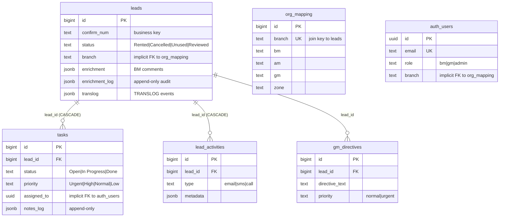

# Database Diagrams

## 1. Overview

LEO uses **Databricks Lakebase Postgres** (PostgreSQL-compatible) with the `uuid-ossp` extension enabled. The database contains **20 tables** created across **18 SQL migration files** in `docs/lakebase-migrations/`.

All tables use `bigint GENERATED ALWAYS AS IDENTITY` for primary keys, except `auth_users` and `user_profiles` which use `uuid` PKs.

---

## 2. Full Entity-Relationship Diagram

```mermaid
erDiagram
    org_mapping {
        bigint id PK
        text bm
        text branch UK
        text am
        text gm
        text zone
        timestamptz created_at
        timestamptz updated_at
    }

    leads {
        bigint id PK
        text customer
        text reservation_id UK
        text confirm_num
        text status "Rented|Cancelled|Unused|Reviewed"
        boolean archived
        boolean enrichment_complete
        text branch
        text bm_name
        text general_mgr
        text area_mgr
        text zone
        text rent_loc
        text insurance_company
        text cdp_name
        text contact_range
        text first_contact_by "branch|hrd|none"
        text time_to_first_contact
        text hles_reason
        text knum
        text body_shop
        date init_dt_final
        date week_of
        int days_open
        boolean mismatch
        text mismatch_reason
        text gm_directive
        jsonb translog
        jsonb enrichment
        jsonb enrichment_log
        text email
        text phone
        bigint last_upload_id
        timestamptz created_at
        timestamptz updated_at
    }

    tasks {
        bigint id PK
        text title
        text description
        date due_date
        text status "Open|In Progress|Done"
        text priority "Urgent|High|Normal|Low"
        text source "gm_assigned|auto_translog|auto_other"
        uuid assigned_to
        uuid created_by
        bigint lead_id FK
        text notes
        jsonb notes_log
        timestamptz completed_at
        text created_by_name
        text assigned_to_name
        timestamptz created_at
        timestamptz updated_at
    }

    lead_activities {
        bigint id PK
        bigint lead_id FK
        text type "email|sms|call"
        uuid performed_by
        text performed_by_name
        jsonb metadata
        timestamptz created_at
    }

    gm_directives {
        bigint id PK
        bigint lead_id FK
        text directive_text
        text priority "normal|urgent"
        date due_date
        uuid created_by
        text created_by_name
        timestamptz created_at
    }

    auth_users {
        uuid id PK
        text email UK
        text password_hash
        text role "bm|gm|admin"
        text display_name
        text branch
        boolean is_active
        timestamptz onboarding_completed_at
        timestamptz created_at
        timestamptz updated_at
    }

    user_profiles {
        uuid id PK
        text role "bm|gm|admin"
        text display_name
        text branch
        text phone
        timestamptz onboarding_completed_at
        timestamptz created_at
        timestamptz updated_at
    }

    branch_managers {
        bigint id PK
        text name UK
        int conversion_rate
        int quartile "1-4"
        timestamptz created_at
    }

    weekly_trends {
        bigint id PK
        text type "bm|gm"
        text week_label
        date week_start
        int total_leads
        int conversion_rate
        int comment_rate
        int cancelled_unreviewed
        int comment_compliance
        timestamptz created_at
    }

    upload_summary {
        bigint id PK
        jsonb hles
        jsonb translog
        text data_as_of_date
        timestamptz created_at
    }

    leaderboard_data {
        bigint id PK
        jsonb branches
        jsonb gms
        jsonb ams
        jsonb zones
        timestamptz created_at
    }

    dashboard_snapshots {
        bigint id PK
        jsonb snapshot
        timestamptz created_at
    }

    observatory_snapshots {
        bigint id PK
        jsonb snapshot
        timestamptz created_at
    }

    cancellation_reason_categories {
        bigint id PK
        text category
        jsonb reasons
        int sort_order
        timestamptz created_at
    }

    next_actions {
        bigint id PK
        text action UK
        int sort_order
        timestamptz created_at
    }

    wins_learnings {
        bigint id PK
        text bm_name
        text branch
        text gm_name
        text content
        date week_of
        timestamptz created_at
    }

    feedback {
        bigint id PK
        uuid user_id
        text user_name
        boolean is_anonymous
        int rating "1-5"
        text feedback_text
        text comments
        timestamptz created_at
    }

    feature_requests {
        bigint id PK
        uuid user_id
        text requester_name
        text title
        text description
        text current_process
        text frequency
        text time_spent
        timestamptz created_at
    }

    feature_request_upvotes {
        bigint id PK
        bigint feature_request_id FK
        uuid user_id
        timestamptz created_at
    }

    leads ||--o{ tasks : "lead_id"
    leads ||--o{ lead_activities : "lead_id"
    leads ||--o{ gm_directives : "lead_id"
    feature_requests ||--o{ feature_request_upvotes : "feature_request_id"
```

---

## 3. Core Data Model (Focused View)

This simplified diagram shows only the primary operational tables and their relationships:

---

## 4. Table Groups

### Core Data (migrations 001, 003)

| Table | Purpose | Row Volume |
|-------|---------|-----------|
| `leads` | Main lead/reservation data — one row per HLES reservation | 800K+ |
| `tasks` | GM-assigned and auto-created action items for BMs | Thousands |
| `lead_activities` | Contact actions (email, SMS, call) on leads | Thousands |
| `gm_directives` | Per-lead GM instructions to branches | Hundreds |
| `wins_learnings` | BM weekly meeting prep submissions | Hundreds |
| `org_mapping` | BM → Branch → AM → GM → Zone hierarchy | ~15-50 rows |

### Authentication & Users (migrations 008, 001)

| Table | Purpose |
|-------|---------|
| `auth_users` | MVP authentication — email, bcrypt password, role, branch |
| `user_profiles` | Legacy role assignment (predates auth_users, may be unused) |
| `branch_managers` | Cached BM metrics (name, conversion_rate, quartile) |

### Pre-computed Snapshots (migrations 008, 015)

| Table | Purpose |
|-------|---------|
| `dashboard_snapshots` | Pre-computed dashboard metrics as single JSONB blob |
| `observatory_snapshots` | Pre-computed observatory analytics as single JSONB blob |

### Configuration (migration 001)

| Table | Purpose |
|-------|---------|
| `cancellation_reason_categories` | Dropdown options for cancellation reasons |
| `next_actions` | Dropdown options for BM follow-up actions |

### Metrics (migration 001)

| Table | Purpose |
|-------|---------|
| `weekly_trends` | BM/GM weekly metrics history |
| `leaderboard_data` | Cached leaderboard rankings as JSONB |

### Upload Tracking (migration 001)

| Table | Purpose |
|-------|---------|
| `upload_summary` | Tracks each HLES/TRANSLOG upload with stats |

### Collaboration (migration 016)

| Table | Purpose |
|-------|---------|
| `feedback` | User feedback with star ratings |
| `feature_requests` | Feature request tracking |
| `feature_request_upvotes` | Per-user upvote toggle for feature requests |

---

## 5. Relationships

### Explicit Foreign Keys

| FK Column | From Table | To Table | On Delete |
|-----------|-----------|----------|-----------|
| `lead_id` | tasks | leads | CASCADE |
| `lead_id` | lead_activities | leads | CASCADE |
| `lead_id` | gm_directives | leads | *(no action)* |
| `feature_request_id` | feature_request_upvotes | feature_requests | CASCADE |

### Implicit Relationships (joined by text value, no FK constraint)

| Join Column | Left Table | Right Table | Notes |
|------------|-----------|-------------|-------|
| `branch` | leads | org_mapping | Text match — branch names must match exactly |
| `branch` | auth_users | org_mapping | BM's assigned branch |
| `branch` | wins_learnings | org_mapping | BM's branch |
| `general_mgr` | leads | org_mapping.gm | GM name text match |
| `bm_name` | leads | org_mapping.bm | BM name text match |
| `assigned_to` | tasks | auth_users.id | UUID match, no FK |
| `created_by` | tasks | auth_users.id | UUID match, no FK |
| `performed_by` | lead_activities | auth_users.id | UUID match, no FK |
| `created_by` | gm_directives | auth_users.id | UUID match, no FK |
| `user_id` | feedback | auth_users.id | UUID match, no FK |
| `user_id` | feature_requests | auth_users.id | UUID match, no FK |

---

## 6. Index Strategy

### From migration 001 (core indexes)

| Index | Table | Columns | Purpose |
|-------|-------|---------|---------|
| `idx_leads_status` | leads | status | Filter by lead status |
| `idx_leads_branch` | leads | branch | Filter leads by branch |
| `idx_leads_archived` | leads | archived | Exclude archived leads |
| `idx_leads_enrichment_complete` | leads | enrichment_complete | Find unenriched leads |
| `idx_tasks_assigned_to` | tasks | assigned_to | BM's task list |
| `idx_tasks_status` | tasks | status | Filter by task status |
| `idx_tasks_lead_id` | tasks | lead_id | Tasks for a specific lead |
| `idx_tasks_priority` | tasks | priority | Sort by priority |
| `idx_lead_activities_lead_id` | lead_activities | lead_id | Activities for a lead |
| `idx_lead_activities_created_at` | lead_activities | created_at | Activity timeline |

### From migration 004 (HLES columns)

| Index | Table | Columns | Purpose |
|-------|-------|---------|---------|
| `idx_leads_zone` | leads | zone | Filter by zone |
| `idx_leads_week_of` | leads | week_of | Filter by HLES week |
| `idx_leads_general_mgr` | leads | general_mgr | GM's lead list |

### From migration 017 (800K scale performance)

| Index | Table | Columns | Condition | Purpose |
|-------|-------|---------|-----------|---------|
| `idx_leads_active_branch_date` | leads | branch, COALESCE(init_dt_final, week_of) DESC | archived = false | Branch lead list sorted by date |
| `idx_leads_active_status` | leads | status | archived = false | Active leads by status |
| `idx_leads_active_gm` | leads | general_mgr | archived = false | GM's active leads |
| `idx_leads_directive` | leads | branch | archived = false AND gm_directive IS NOT NULL | Leads with directives |
| `idx_leads_enrichment_todo` | leads | branch, status | archived = false AND enrichment_complete = false | Unenriched leads queue |

### Snapshot & other indexes

| Index | Table | Columns | Purpose |
|-------|-------|---------|---------|
| `idx_dashboard_snapshots_created_at` | dashboard_snapshots | created_at DESC | Latest snapshot first |
| `idx_observatory_snapshots_created_at` | observatory_snapshots | created_at DESC | Latest snapshot first |
| `idx_auth_users_email` | auth_users | email | Login lookup |
| `idx_gm_directives_lead_id` | gm_directives | lead_id | Directives per lead |
| `idx_gm_directives_created_at` | gm_directives | created_at | Directive timeline |
| `idx_wins_learnings_branch` | wins_learnings | branch | Filter by branch |
| `idx_wins_learnings_week_of` | wins_learnings | week_of | Filter by week |
| `idx_feedback_created_at` | feedback | created_at DESC | Latest feedback first |
| `idx_feature_requests_created_at` | feature_requests | created_at DESC | Latest requests first |
| `idx_feature_request_upvotes_request_id` | feature_request_upvotes | feature_request_id | Upvotes per request |

---

## 7. Migration File Reference

| File | Tables/Changes |
|------|---------------|
| `001_full_schema.sql` | Creates 11 tables: org_mapping, leads, branch_managers, weekly_trends, upload_summary, leaderboard_data, cancellation_reason_categories, next_actions, user_profiles, tasks, lead_activities |
| `002_seed_config.sql` | Seeds org_mapping, cancel reasons, next actions |
| `003_phase2_tables.sql` | Creates gm_directives, wins_learnings |
| `004_add_lead_columns.sql` | Adds 17 columns to leads (confirm_num, knum, zone, etc.) |
| `004_add_lead_columns_and_grants.sql` | Same + GRANT statements |
| `005_confirm_num_unique_reservation_id_nullable.sql` | UNIQUE on confirm_num, nullable reservation_id |
| `006_delete_demo_data.sql` | Cleans demo seed data |
| `007_bm_from_employee_listing_frankel.sql` | BM org mapping updates |
| `007a_export_branches_for_bm_mapping.sql` | Branch export helper |
| `008_auth_users.sql` | Creates auth_users + seeds 3 MVP users |
| `008_dashboard_snapshots.sql` | Creates dashboard_snapshots |
| `009_grant_auth_users.sql` | GRANT statements for auth_users |
| `014_auth_users_onboarding.sql` | Adds onboarding_completed_at to auth_users |
| `015_observatory_snapshots.sql` | Creates observatory_snapshots |
| `016_feedback_feature_requests.sql` | Creates feedback, feature_requests, feature_request_upvotes |
| `017_performance_indexes.sql` | Partial indexes for 800K scale |
| `018_restore_org_mapping_march2026.sql` | Org mapping data restore |
| `019_disable_compromised_accounts.sql` | Account disabling after security incident |
