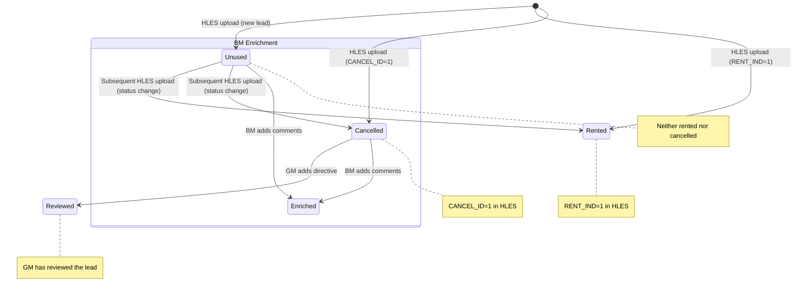

# Detailed Data Models

This document provides column-level detail for all 20 database tables, JSONB schema documentation, ETL column mappings, and the lead data lifecycle.

> For visual ER diagrams, see [05-database-diagrams.md](05-database-diagrams.md).
> For domain term definitions, see [01-business-context-glossary.md](01-business-context-glossary.md).

---

## 1. leads

**Purpose:** Main lead/reservation data — one row per HLES insurance replacement reservation. Central table for the entire application.

**Business key:** `confirm_num` (UNIQUE) — the Confirmation Number from HLES.

| Column | Type | Nullable | Default | Constraints | Description |
|--------|------|----------|---------|-------------|-------------|
| id | bigint | NO | IDENTITY | PK | Auto-incrementing surrogate key |
| customer | text | NO | | | Customer last name (RENTER_LAST from HLES) |
| reservation_id | text | YES | | UNIQUE | Set to confirm_num for display compatibility |
| confirm_num | text | YES | | | Confirmation number — the true business key |
| status | text | NO | | CHECK (Rented, Cancelled, Unused, Reviewed) | Lead outcome status |
| archived | boolean | YES | false | | Soft archive flag |
| enrichment_complete | boolean | YES | false | | Whether BM has added comments to this lead |
| branch | text | NO | | | Branch/location (RENT_LOC from HLES) |
| bm_name | text | YES | | | Branch manager name (resolved from org_mapping) |
| general_mgr | text | YES | | | General manager name (from HLES) |
| area_mgr | text | YES | | | Area manager name (from HLES) |
| zone | text | YES | | | Zone (from HLES) |
| rent_loc | text | YES | | | Raw RENT_LOC value from HLES |
| insurance_company | text | YES | | | CDP_NAME — insurance company (from HLES) |
| cdp_name | text | YES | | | Raw CDP_NAME from HLES |
| contact_range | text | YES | | | Time to contact bucket (e.g., "(a)<30min", "NO CONTACT") |
| first_contact_by | text | YES | | CHECK (branch, hrd, none) | Who made first contact |
| time_to_first_contact | text | YES | | | MIN_DIF from HLES — stored as text, not numeric |
| time_to_cancel | text | YES | | | Time from creation to cancellation |
| hles_reason | text | YES | | | CANCEL_REASON from HLES |
| knum | text | YES | | | K-number from HLES |
| body_shop | text | YES | | | Body shop name from HLES |
| htz_region | text | YES | | | Hertz region (from HLES) |
| set_state | text | YES | | | State/province (from HLES) |
| init_dt_final | date | YES | | | Date reservation received — primary date field |
| week_of | date | YES | | | HLES week bucket (Saturday-to-Friday) |
| days_open | int | YES | 0 | | Computed: CURRENT_DATE - init_dt_final |
| mismatch | boolean | YES | false | | Whether HLES and TRANSLOG data conflict |
| mismatch_reason | text | YES | | | Explanation of the mismatch |
| gm_directive | text | YES | | | Legacy: initial GM directive text |
| translog | jsonb | YES | '[]' | | TRANSLOG events array |
| enrichment | jsonb | YES | | | Current BM enrichment data |
| enrichment_log | jsonb | YES | '[]' | | Append-only audit log of BM actions |
| email | text | YES | | | Customer email |
| phone | text | YES | | | Customer phone (E.164 format) |
| source_email | text | YES | | | Source system email |
| source_phone | text | YES | | | Source system phone |
| source_status | text | YES | | | Source system status |
| last_upload_id | bigint | YES | | | ID of the upload that last touched this lead |
| created_at | timestamptz | YES | now() | | Row creation timestamp |
| updated_at | timestamptz | YES | now() | | Last update timestamp |

### JSONB: `enrichment`

Current BM enrichment data (overwritten on each save):

```json
{
  "reason": "Customer found alternative transport",
  "notes": "Called twice, no answer. Customer went with Enterprise.",
  "nextAction": "Close - customer chose competitor",
  "updatedBy": "user-uuid",
  "updatedAt": "2026-03-15T14:30:00Z"
}
```

### JSONB: `enrichment_log`

Append-only audit trail of all BM enrichment actions:

```json
[
  {
    "action": "enrichment_updated",
    "timestamp": "2026-03-15T14:30:00Z",
    "author": "Jonathan Hoover",
    "authorId": "user-uuid",
    "reason": "Customer found alternative transport",
    "notes": "Called twice, no answer."
  }
]
```

**Important:** This is append-only — new entries are added to the end, never overwritten. This creates an audit trail of all BM actions on a lead.

### JSONB: `translog`

TRANSLOG events matched to this lead:

```json
[
  {
    "time": "2026-03-10T09:15:00",
    "event": "OUTBOUND_CALL",
    "outcome": "NO_ANSWER"
  },
  {
    "time": "2026-03-10T11:30:00",
    "event": "INBOUND_CALL",
    "outcome": "CONNECTED"
  }
]
```

---

## 2. org_mapping

**Purpose:** Organisational hierarchy — maps branches to their BM, AM, GM, and Zone.

| Column | Type | Nullable | Default | Constraints | Description |
|--------|------|----------|---------|-------------|-------------|
| id | bigint | NO | IDENTITY | PK | |
| bm | text | NO | | | Branch Manager name |
| branch | text | NO | | UNIQUE | Branch/location identifier |
| am | text | NO | | | Area Manager name |
| gm | text | YES | | | General Manager name |
| zone | text | NO | | | Zone name |
| created_at | timestamptz | YES | now() | | |
| updated_at | timestamptz | YES | now() | | |

**Key behaviour:** During HLES upload, org_mapping is upserted — if a branch from the HLES file doesn't exist in org_mapping, it's inserted with the GM, AM, and zone from the HLES data. BM is resolved separately.

---

## 3. auth_users

**Purpose:** MVP authentication table — email/password login with role-based access.

| Column | Type | Nullable | Default | Constraints | Description |
|--------|------|----------|---------|-------------|-------------|
| id | uuid | NO | uuid_generate_v4() | PK | |
| email | text | NO | | UNIQUE | Login email |
| password_hash | text | NO | | | bcrypt-hashed password |
| role | text | NO | | CHECK (bm, gm, admin) | User role |
| display_name | text | NO | | | Display name |
| branch | text | YES | | | BM's assigned branch (null for GM/admin) |
| is_active | boolean | YES | true | | Set false to disable login |
| onboarding_completed_at | timestamptz | YES | | | When user completed first-time tour |
| created_at | timestamptz | YES | now() | | |
| updated_at | timestamptz | YES | now() | | |

**Note:** This table is marked "MVP — Replace with Hertz SSO when ready" (see `routers/auth.py` line 1).

---

## 4. tasks

**Purpose:** Action items for BMs — GM-assigned tasks, auto-created compliance tasks, and TRANSLOG-triggered tasks.

| Column | Type | Nullable | Default | Constraints | Description |
|--------|------|----------|---------|-------------|-------------|
| id | bigint | NO | IDENTITY | PK | |
| title | text | NO | | | Task title |
| description | text | YES | | | Task description |
| due_date | date | YES | | | Due date |
| status | text | NO | 'Open' | CHECK (Open, In Progress, Done) | Task status |
| priority | text | NO | 'Normal' | CHECK (Urgent, High, Normal, Low) | Priority level |
| source | text | YES | 'gm_assigned' | CHECK (gm_assigned, auto_translog, auto_other) | How the task was created |
| assigned_to | uuid | YES | | | BM user UUID |
| created_by | uuid | YES | | | GM user UUID |
| lead_id | bigint | NO | | FK → leads(id) CASCADE | Associated lead |
| translog_event_id | bigint | YES | | | TRANSLOG event that triggered this task |
| notes | text | YES | | | BM work notes |
| notes_log | jsonb | YES | '[]' | | Append-only notes audit trail |
| completed_at | timestamptz | YES | | | Set when status changes to Done |
| created_by_name | text | YES | | | GM display name (denormalised) |
| assigned_to_name | text | YES | | | BM display name (denormalised) |
| created_at | timestamptz | YES | now() | | |
| updated_at | timestamptz | YES | now() | | |

### JSONB: `notes_log`

```json
[
  {
    "note": "Called customer, left voicemail",
    "author": "Jonathan Hoover",
    "authorId": "user-uuid",
    "timestamp": "2026-03-15T10:00:00Z"
  }
]
```

---

## 5. lead_activities

**Purpose:** Contact actions (email, SMS, call) performed on leads.

| Column | Type | Nullable | Default | Constraints | Description |
|--------|------|----------|---------|-------------|-------------|
| id | bigint | NO | IDENTITY | PK | |
| lead_id | bigint | NO | | FK → leads(id) CASCADE | |
| type | text | NO | | CHECK (email, sms, call) | Activity type |
| performed_by | uuid | YES | | | User UUID |
| performed_by_name | text | YES | | | User display name |
| metadata | jsonb | YES | '{}' | | Activity-specific data |
| created_at | timestamptz | YES | now() | | |

---

## 6. gm_directives

**Purpose:** Per-lead instructions issued by a GM to a branch.

| Column | Type | Nullable | Default | Constraints | Description |
|--------|------|----------|---------|-------------|-------------|
| id | bigint | NO | IDENTITY | PK | |
| lead_id | bigint | NO | | FK → leads(id) | |
| directive_text | text | NO | | | The instruction text |
| priority | text | NO | 'normal' | CHECK (normal, urgent) | Priority level |
| due_date | date | YES | | | When the action is due |
| created_by | uuid | YES | | | GM user UUID |
| created_by_name | text | YES | | | GM display name |
| created_at | timestamptz | YES | now() | | |

---

## 7. wins_learnings

**Purpose:** BM weekly meeting prep submissions — wins and learnings from the week.

| Column | Type | Nullable | Default | Constraints | Description |
|--------|------|----------|---------|-------------|-------------|
| id | bigint | NO | IDENTITY | PK | |
| bm_name | text | NO | | | BM name |
| branch | text | NO | | | Branch identifier |
| gm_name | text | YES | | | GM name |
| content | text | NO | | | The win/learning text |
| week_of | date | YES | | | Week this applies to |
| created_at | timestamptz | YES | now() | | |

---

## 8. dashboard_snapshots

**Purpose:** Pre-computed dashboard metrics stored as a single JSONB blob. Computed after each HLES upload by `services/snapshot.py`.

| Column | Type | Nullable | Default | Description |
|--------|------|----------|---------|-------------|
| id | bigint | NO | IDENTITY | PK |
| snapshot | jsonb | NO | | Full dashboard metrics payload |
| created_at | timestamptz | YES | now() | Computation timestamp |

The frontend fetches `GET /api/dashboard-snapshot` which returns the latest row's `snapshot` JSONB. This avoids real-time aggregation queries against 800K+ leads.

---

## 9. observatory_snapshots

**Purpose:** Pre-computed observatory analytics metrics. Computed after each HLES upload by `services/observatory_snapshot.py`.

| Column | Type | Nullable | Default | Description |
|--------|------|----------|---------|-------------|
| id | bigint | NO | IDENTITY | PK |
| snapshot | jsonb | NO | | Observatory metrics payload |
| created_at | timestamptz | YES | now() | Computation timestamp |

---

## 10. upload_summary

**Purpose:** Tracks each data upload with statistics.

| Column | Type | Nullable | Default | Description |
|--------|------|----------|---------|-------------|
| id | bigint | NO | IDENTITY | PK |
| hles | jsonb | NO | | HLES upload stats |
| translog | jsonb | NO | | TRANSLOG upload stats |
| data_as_of_date | text | NO | | Date the data represents |
| created_at | timestamptz | YES | now() | |

### JSONB: `hles`

```json
{
  "ingestion_status": "success",
  "rowsParsed": 5000,
  "newLeads": 300,
  "updated": 4500,
  "skipped": 200,
  "failed": 0,
  "ingestion_error": null
}
```

---

## 11-14. Configuration Tables

### cancellation_reason_categories

Dropdown options for BM cancellation reason selection.

| Column | Type | Description |
|--------|------|-------------|
| id | bigint | PK |
| category | text | Category name (e.g., "Customer Decision") |
| reasons | jsonb | Array of reason strings within this category |
| sort_order | int | Display order |

### next_actions

Dropdown options for BM follow-up action selection.

| Column | Type | Description |
|--------|------|-------------|
| id | bigint | PK |
| action | text (UNIQUE) | Action text (e.g., "Follow up call") |
| sort_order | int | Display order |

### branch_managers

Cached BM metrics (may be legacy — populated from snapshot data).

| Column | Type | Description |
|--------|------|-------------|
| id | bigint | PK |
| name | text (UNIQUE) | BM name |
| conversion_rate | int | Conversion rate percentage |
| quartile | int (1-4) | Performance quartile |

### weekly_trends

BM/GM weekly metrics history.

| Column | Type | Description |
|--------|------|-------------|
| id | bigint | PK |
| type | text (bm\|gm) | Metrics type |
| week_label | text | Display label |
| week_start | date | Week start date |
| total_leads | int | Lead count |
| conversion_rate | int | Conversion % |
| comment_rate | int | Comment compliance % |
| cancelled_unreviewed | int | GM-specific metric |
| comment_compliance | int | GM-specific metric |

---

## 15. user_profiles

**Purpose:** Legacy role assignment table — predates `auth_users`. May be unused in current application.

| Column | Type | Description |
|--------|------|-------------|
| id | uuid | PK |
| role | text (bm\|gm\|admin) | User role |
| display_name | text | Display name |
| branch | text | BM's branch (null for GM/admin) |
| phone | text | BM phone (E.164) |
| onboarding_completed_at | timestamptz | Onboarding timestamp |

---

## 16. leaderboard_data

**Purpose:** Cached leaderboard rankings as JSONB blobs.

| Column | Type | Description |
|--------|------|-------------|
| id | bigint | PK |
| branches | jsonb | Branch leaderboard data |
| gms | jsonb | GM leaderboard data |
| ams | jsonb | AM leaderboard data |
| zones | jsonb | Zone leaderboard data |

---

## 17-19. Feedback Tables

### feedback

| Column | Type | Description |
|--------|------|-------------|
| id | bigint | PK |
| user_id | uuid | Submitter UUID |
| user_name | text | Submitter name |
| is_anonymous | boolean | Whether to mask identity |
| rating | int (1-5) | Star rating |
| feedback_text | text | Feedback content |
| comments | text | Additional comments |

### feature_requests

| Column | Type | Description |
|--------|------|-------------|
| id | bigint | PK |
| user_id | uuid | Requester UUID |
| requester_name | text | Requester name |
| title | text | Request title |
| description | text | Detailed description |
| current_process | text | How they do it today |
| frequency | text | How often they need it |
| time_spent | text | Time spent on current workaround |

### feature_request_upvotes

| Column | Type | Constraints | Description |
|--------|------|-------------|-------------|
| id | bigint | PK | |
| feature_request_id | bigint | FK → feature_requests(id) CASCADE | |
| user_id | uuid | UNIQUE(feature_request_id, user_id) | One upvote per user per request |

---

## 20. Lead Lifecycle



### Lead Creation (HLES Upload)

1. Admin uploads HLES Excel → `POST /api/upload/hles`
2. `etl/clean.py` normalises columns, derives status from flags, resolves BM via org_mapping
3. Deduplication on `confirm_num` — new leads = INSERT, existing = UPDATE
4. Background tasks trigger: snapshot computation, observatory computation, days_open refresh

### Lead Enrichment (BM Workflow)

1. BM views lead in Lead Queue
2. BM adds enrichment via `PUT /api/leads/{id}/enrichment`
3. Backend updates `enrichment` JSONB and appends to `enrichment_log`
4. Sets `enrichment_complete = true`

### Lead Review (GM Workflow)

1. GM views lead, issues directive via `POST /api/leads/{id}/directives`
2. Directive stored in `gm_directives` table
3. Lead status changed to "Reviewed" if GM marks it

---

## 21. ETL Column Mapping

### HLES Excel → leads table

| HLES Column (raw) | After Normalisation | leads Column | Notes |
|---|---|---|---|
| `\nCONFIRM_NUM` | `confirm_num` | `confirm_num` | Business key (UNIQUE) |
| `\nRENTER_LAST` | `renter_last` | `customer` | Customer last name |
| `\nCDP NAME` | `cdp_name` | `insurance_company` | Also stored in `cdp_name` |
| `\nRENT_LOC` | `rent_loc` | `branch` | Also stored in `rent_loc` |
| `\nGENERAL_MGR` | `general_mgr` | `general_mgr` | |
| `\nAREA_MGR` | `area_mgr` | `area_mgr` | |
| `\nZONE` | `zone` | `zone` | |
| `\nHTZREGION` | `htzregion` | `htz_region` | |
| `\nSET_STATE` | `set_state` | `set_state` | |
| `\nCANCEL REASON` | `cancel_reason` | `hles_reason` | |
| `\nRENT_IND` | `rent_ind` | *(used for status derivation)* | 1=Rented |
| `\nCANCEL_ID` | `cancel_id` | *(used for status derivation)* | 1=Cancelled |
| `\nUNUSED_IND` | `unused_ind` | *(used for status derivation)* | 1=Unused |
| `\nCONTACT_GROUP` | `contact_group` | `first_contact_by` | COUNTER→branch, HRD→hrd, else→none |
| `\nINIT_DT_FINAL` | `init_dt_final` | `init_dt_final` | Parsed to date |
| `\nWeek Of` | `week_of` | `week_of` | Parsed to date |
| `\nCONTACT RANGE` | `contact_range` | `contact_range` | |
| `\nBODY SHOP` | `body_shop` | `body_shop` | |
| `\nKNUM` | `knum` | `knum` | |
| `\nMIN_DIF` | `min_dif` | `time_to_first_contact` | Stored as text |

### Status Derivation Logic

```
if RENT_IND == 1 → "Rented"
else if CANCEL_ID == 1 → "Cancelled"
else if UNUSED_IND == 1 → "Unused"
else → "Unused" (default)
```

### BM Name Resolution

HLES does not contain BM names. During ETL, the upload router:
1. Queries `org_mapping` to build a `branch → bm_name` lookup dict
2. Maps each lead's `branch` to the corresponding BM
3. If no match found, `bm_name` is left null (column is nullable since migration 004)

### Column Normalisation

HLES Excel headers have leading `\n` characters. The ETL applies:
```python
re.sub(r'\s+', '_', col.strip().lower())
```
This converts `\nCONFIRM_NUM` → `confirm_num`, `\nCDP NAME` → `cdp_name`, etc.

---

## 22. Business Rules

1. **confirm_num uniqueness:** Each lead is identified by its confirmation number. HLES uploads use INSERT for new confirm_nums and UPDATE for existing ones.

2. **enrichment_log is append-only:** New entries are always appended to the array, never overwritten. This creates an immutable audit trail of all BM enrichment actions.

3. **time_to_first_contact is stored as text:** The MIN_DIF value from HLES is stored as-is (text), not parsed to numeric. Frontend handles display formatting.

4. **contact_range values:** `(a)<30min`, `(b)30-60min`, `(c)1-3 hrs`, `(d)3-6 hrs`, `(e)6-12 hrs`, `(f)12-24 hrs`, `(g)>24 hrs`, `NO CONTACT`

5. **first_contact_by values:** `branch` (COUNTER in HLES), `hrd` (HRD call centre), `none` (NO CONTACT)

6. **Status CHECK constraint:** `Rented`, `Cancelled`, `Unused`, `Reviewed` — only these four values are valid.

7. **Snapshot computation:** Triggered automatically after HLES upload via FastAPI `BackgroundTasks`. The latest `dashboard_snapshots` row is served by the API.
