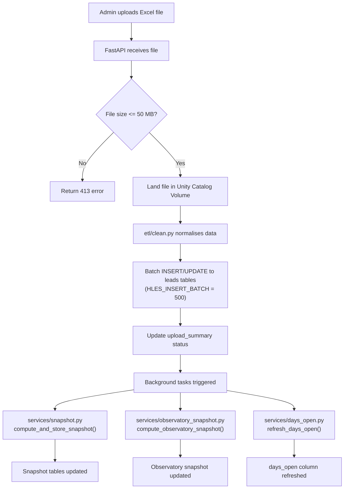

# 08 — Operational Runbook

> Day-to-day operations, setup, troubleshooting, and incident response for the LEO Lead Management System.

---

## 1. Local Development Setup

Condensed from `docs/LOCAL-DEV-SETUP.md` — refer there for full detail.

### 1.1 Prerequisites

| Tool | Version | Notes |
|------|---------|-------|
| Python | 3.12 | `python --version` to verify |
| Node.js | 22.x | Matches `.nvmrc` |
| PostgreSQL | 16 or 17 | Neon (cloud) or local install both work |
| Git | Latest | Required for clone and deployment |

### 1.2 Clone and Install

```bash
git clone https://github.com/popcornAlesto33/Prototype-LMS-Databricks.git
cd Prototype-LMS-Databricks
python -m pip install -r requirements.txt
npm install
```

### 1.3 Environment Configuration

```bash
cp .env.local.example .env.local
```

Minimum values in `.env.local`:

```
APP_ENV=local
APP_TIER=local
PGHOST=localhost
PGDATABASE=lms_leo
PGUSER=postgres
PGPASSWORD=<your local postgres password>
PGPORT=5432
LEO_JWT_SECRET=<local-only secret>
HLES_LANDING_VOLUME_PATH=./local-uploads/hles
TRANSLOG_LANDING_VOLUME_PATH=./local-uploads/translog
```

### 1.4 Database Initialization

```bash
createdb lms_leo
psql -d lms_leo -f scripts/setup_local_db.sql
```

Or use the setup script:

```bash
python scripts/run_setup_db.py
```

### 1.5 Seed Data

```bash
python scripts/seed_local_data.py "prodfiles/MainChaddata.xlsx" --target local
```

Optional — create a branch-aligned BM test user:

```bash
python scripts/seed_local_data.py "prodfiles/MainChaddata.xlsx" --target local --create-aligned-bm-user
```

### 1.6 Start the Stack

**Terminal 1 — Backend (port 8000):**

```bash
uvicorn main:app --reload
```

**Terminal 2 — Frontend (port 5173):**

```bash
npm run dev
```

Vite proxies all `/api` requests to `localhost:8000`. Open `http://localhost:5173` in a browser to use the app.

### 1.7 Verify

- `http://localhost:5173` — login with seeded test users, confirm dashboards load
- `http://localhost:8000/api/health/runtime` — should return `env=local`, `tier=local`

---

## 2. Common Operational Tasks

### 2.1 Weekly HLES Upload

1. Log in as an admin user.
2. Navigate to `/admin/uploads`.
3. Click "Upload HLES", select the Excel file (max 50 MB).
4. Monitor the ingestion status indicator on the same page.
5. Background tasks (snapshot recomputation, observatory snapshot, days_open refresh) run automatically after ingestion completes.

### 2.2 TRANSLOG Upload

Same flow as HLES: `/admin/uploads` then select the TRANSLOG file. The backend routes to a separate ETL path (`etl/clean.clean_translog_data`) and writes to the translog tables.

### 2.3 Adding a New User

Generate a bcrypt password hash:

```bash
python -c "import bcrypt; print(bcrypt.hashpw(b'Password123', bcrypt.gensalt(12)).decode())"
```

Insert into the database:

```sql
INSERT INTO auth_users (email, password_hash, role, display_name, branch)
VALUES ('new.user@hertz.com', '<bcrypt hash>', 'bm', 'New User', '7401-01 - PERRINE HLE');
```

Valid roles: `bm`, `gm`, `admin`. The `branch` column is required for BM users, null for GM/admin.

### 2.4 Disabling a User

```sql
UPDATE auth_users SET is_active = false WHERE email = 'user@hertz.com';
```

This prevents login without deleting the row. The user's historical data remains intact.

### 2.5 Changing a Password

Generate a new bcrypt hash (see 2.3), then:

```sql
UPDATE auth_users SET password_hash = '<new bcrypt hash>' WHERE email = 'user@hertz.com';
```

### 2.6 Updating Org Mapping

**Via Admin UI (preferred):**
Navigate to `/admin/org-mapping`, find the branch, edit the BM assignment inline.

**Via API:**

```bash
curl -X PATCH /api/config/org-mapping/{branch}/bm \
  -H "Authorization: Bearer <token>" \
  -H "Content-Type: application/json" \
  -d '{"bm": "New Manager Name"}'
```

**Bulk re-seed from source files:**

```bash
source .venv/bin/activate
env $(cat .env.local | grep -v '^#' | xargs) python scripts/seed_org_mapping_from_prodfiles.py
```

See `docs/ORG-MAPPING-SETUP.md` for full detail on source files, join logic, and verification queries.

### 2.7 Manual Snapshot Recomputation

Upload a file through the admin UI to trigger a full recomputation, or call the snapshot service directly:

```python
from services.snapshot import compute_and_store_snapshot
compute_and_store_snapshot()
```

When running as a standalone script, activate the venv and inject `.env.local` first:

```bash
source .venv/bin/activate
env $(cat .env.local | grep -v '^#' | xargs) python -c "from services.snapshot import compute_and_store_snapshot; compute_and_store_snapshot()"
```

### 2.8 Manual days_open Refresh

```bash
curl -X POST /api/upload/refresh-days-open \
  -H "Authorization: Bearer <admin-token>"
```

---

## 3. Database Operations

### 3.1 Running Migrations

Migrations are plain SQL files in `docs/lakebase-migrations/`. Execute them in the Lakebase SQL editor (for staging/prod) or via `psql` (for local).

**Promotion order is strict:** local --> staging --> prod. Never skip staging.

Migration rollback is forward-fix only — there is no rollback mechanism.

### 3.2 Schema Drift Check

```bash
python scripts/check_schema_drift.py --target staging
python scripts/check_schema_drift.py --target prod
python scripts/check_schema_drift.py --target local
```

Returns clean if the target database matches the expected schema. Run this before every deployment.

### 3.3 Local Reset

```powershell
./scripts/reset_local.ps1
```

This drops and recreates `lms_leo`, runs `setup_local_db.sql`, re-seeds data, and restarts the stack. Use `-SkipSeed` to skip the seed step.

See `docs/LOCAL-RESET-RUNBOOK.md` for failure signatures and verification checklist.

### 3.4 Org Mapping Export/Import

```bash
# Export current org mapping to JSON
python scripts/export_org_mapping.py

# Import org mapping from JSON
python scripts/import_org_mapping.py

# Verify parity between environments
python scripts/verify_org_mapping_parity.py
```

---

## 4. Deployment Procedures

Deployment follows a strict local --> staging --> prod pipeline with gating artifacts.

```
Local Dev  -->  git push  -->  deploy_staging.ps1  -->  smoke_test.py  -->  staging_passed_<sha>.json  -->  deploy_prod.ps1  -->  smoke_test.py --read-only
```

**Staging deploy:**

```powershell
./scripts/deploy_staging.ps1 -BaseUrl https://<staging-app-url>
```

**Prod deploy** (requires matching staging pass artifact for the same commit SHA):

```powershell
./scripts/deploy_prod.ps1 -BaseUrl https://<prod-app-url>
```

Key guardrails:
- Collision guard in `db.py` blocks staging from using the prod database (`databricks_postgres`).
- `app.yaml` runtime branching by `DATABRICKS_APP_NAME` determines `APP_TIER` and `PGDATABASE`.
- Prod deploy requires operator confirmation prompt.

See [03-infrastructure-deployment.md](03-infrastructure-deployment.md) for full deployment architecture and `docs/DEPLOYMENT-WORKFLOW.md` for step-by-step detail.

---

## 5. Upload Ingestion Flowchart



The upload router (`routers/upload.py`) processes files in batches (`HLES_SELECT_CHUNK = 2000`, `HLES_INSERT_BATCH = 500`, `HLES_UPDATE_BATCH = 500`) to reduce DB round-trips and stay under gateway timeouts.

---

## 6. Troubleshooting Guide

| Symptom | Likely Cause | Fix |
|---------|-------------|-----|
| BM/GM sees empty leads | `org_mapping` branch name mismatch | Check for whitespace differences between `org_mapping.branch` and `auth_users.branch`. Run `verify_org_mapping_parity.py`. |
| Snapshot not updating after upload | Background task failed silently | Check server logs for `[upload]` prefix entries. Manually trigger snapshot recomputation (see section 2.7). |
| JWT token expired | 8-hour token expiry | User must re-login. No action needed from ops. |
| Connection pool errors | Stale credentials or pool exhaustion | Check `PGHOST` and credential freshness (Databricks tokens rotate). Review pool sizing in `db.py`. |
| Upload fails with 413 | File exceeds 50 MB limit | Split the Excel file or increase `MAX_UPLOAD_SIZE` in `routers/upload.py`. |
| Staging points at prod database | Collision guard misconfigured | Check `PGDATABASE` env var — staging must use `lms_staging`, never `databricks_postgres`. The collision guard in `db.py` should hard-fail on this. |
| Data exists in DB but not in UI | Snapshot stale, parser mismatch, or falsy-value bug | Check snapshot freshness (was it recomputed after the latest upload?). Look for parser mismatches in `etl/clean.py`. Check for falsy-value bugs where `0` is treated as missing. See [07-known-issues-tech-debt.md](07-known-issues-tech-debt.md). |
| `psql` not found | PostgreSQL bin not in PATH | Add PostgreSQL `bin` directory to PATH and restart terminal. |
| Local app connects to remote DB | `.env.local` misconfigured | Confirm `APP_ENV=local` and `PGHOST=localhost` in `.env.local`. The runtime guard will fail startup if misconfigured. |
| Empty dashboards after seed | Seed did not populate snapshot tables | Re-run `seed_local_data.py` and confirm snapshot tables are populated. |

---

## 7. Monitoring and Logging

### 7.1 Request Tracing

All requests are logged with a `trace_id` derived from the `X-Request-ID` header. Include this header value when reporting issues.

### 7.2 Log Prefix Conventions

| Prefix | Source |
|--------|--------|
| `[startup]` | Application boot, env detection, DB connection |
| `[request]` | HTTP request/response logging |
| `[error]` | Unhandled exceptions |
| `[upload]` | File upload processing, ETL, background tasks |
| `[leads-api]` | Leads query endpoint |
| `[snapshot-api]` | Snapshot computation and retrieval |
| `[activity-report]` | Activity report generation |
| `[env]` | Environment variable resolution |

### 7.3 Health Check

```
GET /api/health/runtime
```

Returns: `env`, `tier`, `host`, `db`. Open in local mode; auth-protected in staging/prod.

### 7.4 External Monitoring

There is currently no external monitoring or alerting system. Log inspection is manual via Databricks Apps logs.

---

## 8. Incident Response

### 8.1 Compromised Credentials

1. **Immediately** disable the affected user:
   ```sql
   UPDATE auth_users SET is_active = false WHERE email = '<compromised-email>';
   ```
2. Rotate the `LEO_JWT_SECRET` environment variable in the affected tier. This invalidates all existing tokens and forces re-login for all users.
3. Generate a new password hash and update the user's record once the incident is resolved.
4. Reference migration `019` for the pattern used when credentials were previously compromised.

### 8.2 Data Corruption

- **Forward-fix only.** There is no rollback mechanism for data or schema changes.
- Identify the scope of corruption (which tables, which date range).
- If leads data is corrupted, re-upload the source HLES/TRANSLOG file to overwrite with clean data.
- If snapshot data is stale or incorrect, trigger a manual snapshot recomputation (section 2.7).

### 8.3 Service Outage

1. Check Databricks Apps status for the affected tier (`hertz-leo-lms-staging` or `hertz-leo-leadsmgmtsystem`).
2. Verify database connectivity: check `PGHOST`, credentials, and network access.
3. Check `/api/health/runtime` — if it responds, the app is running but may have a downstream issue.
4. Review recent logs with `[startup]` and `[error]` prefixes.
5. If the app is unresponsive, redeploy via the appropriate deploy script.

---

## 9. Scripts Inventory

| Script | Purpose |
|--------|---------|
| `setup_local.sh` | Local dev bootstrap (Unix/macOS) |
| `start_local.sh` | Start local stack (Unix/macOS) |
| `start_local.ps1` | Start local stack (Windows) — loads `.env.local`, verifies Postgres, starts FastAPI + Vite |
| `setup_local_db.sql` | SQL schema initialization — creates all tables, indexes, config, auth seed, `schema_migrations` |
| `run_setup_db.py` | Python wrapper to run `setup_local_db.sql` against the configured database |
| `seed_local_data.py` | Seed test users, config, sample leads from an HLES Excel file; runs snapshot + observatory + days_open |
| `seed_org_mapping_from_prodfiles.py` | Import org mapping from HLES + employee listing CSVs/Excel; upserts preserving manual BM edits |
| `import_org_mapping.py` | Import org mapping from a JSON export |
| `export_org_mapping.py` | Export current org mapping to JSON |
| `verify_org_mapping_parity.py` | Verify org mapping consistency between environments or against source files |
| `deploy_staging.ps1` | Full staging deployment pipeline: build, compile, schema check, push, deploy, smoke test, gate artifact |
| `deploy_prod.ps1` | Full prod deployment pipeline: validate staging gate, build, compile, schema check, push, deploy, verify |
| `smoke_test.py` | Integration smoke tests — validates auth, API contracts, data presence; supports `--read-only` for prod |
| `check_schema_drift.py` | Compare target database schema against expected state; returns clean or lists drift |
| `compare_migration_state.py` | Compare migration state between environments |
| `test_api_contracts.py` | API contract tests — validates response shapes and status codes |
| `test_e2e_800k.py` | End-to-end performance test with large dataset |
| `backfill_hles_20260316.py` | One-time historical data backfill for March 16, 2026 HLES data |
| `reset_local.ps1` | Clean local reset: drop DB, recreate, run setup SQL, re-seed, restart stack |

---

## Cross-References

- [03-infrastructure-deployment.md](03-infrastructure-deployment.md) — full deployment architecture, Databricks Apps config, environment targeting
- [07-known-issues-tech-debt.md](07-known-issues-tech-debt.md) — known gotchas, falsy-value bugs, snapshot timing issues
- `docs/LOCAL-DEV-SETUP.md` — full local setup walkthrough
- `docs/LOCAL-RESET-RUNBOOK.md` — reset procedure and failure signatures
- `docs/DEPLOYMENT-WORKFLOW.md` — step-by-step deployment commands
- `docs/ORG-MAPPING-SETUP.md` — org mapping source files, join logic, verification
