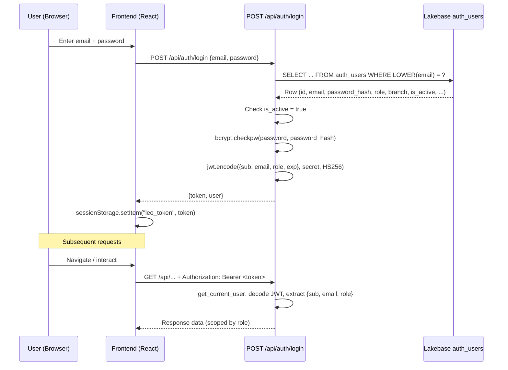
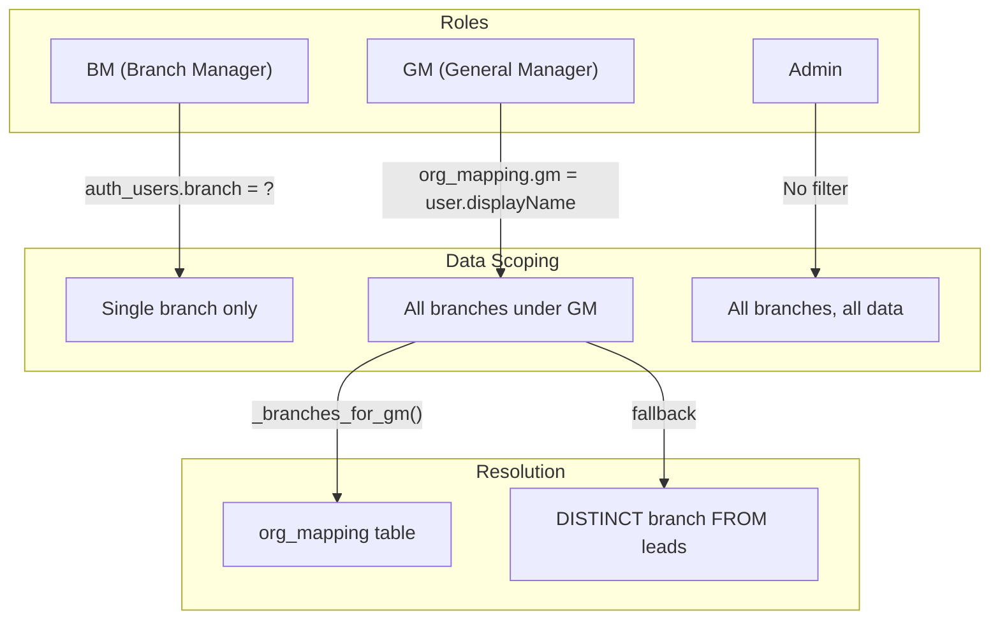

# 09 — Security & Access Control

> **LEO Handover Document** | Last updated: 2026-03-26

---

## 1. Security Architecture Overview

LEO uses a lightweight, MVP-grade authentication and authorization system built around bcrypt-hashed passwords stored in a Lakebase `auth_users` table and short-lived JWTs issued by the FastAPI backend. Users authenticate via email/password, receive an HS256-signed JWT valid for 8 hours, and present that token on every subsequent API request. Role-based data scoping is enforced at the query level — Branch Managers see only their branch, General Managers see branches resolved through `org_mapping`, and Admins see everything — but role checks are **not** uniformly enforced across all API endpoints, which is a known security gap. Databricks connectivity uses OAuth-based credential generation via the `databricks-sdk` `WorkspaceClient`, meaning no long-lived database passwords are stored in the deployed application. This architecture is adequate for an internal MVP but must be hardened before broader rollout or external exposure.

---

## 2. Authentication Flow

### Sequence Diagram



---

## 3. Authentication Details

### JWT Configuration

| Parameter | Value |
|---|---|
| Algorithm | HS256 |
| Expiry | 8 hours from issue |
| Payload fields | `sub` (user UUID), `email`, `role`, `exp` (UTC timestamp) |
| Secret env var | `LEO_JWT_SECRET` |
| Default fallback | `leo-mvp-secret-change-in-prod` (insecure — must be rotated) |
| Library | PyJWT (`jwt.encode` / `jwt.decode`) |

### Token Extraction Strategies

The `get_current_user` dependency (and the parallel `_user_from_jwt` in `leads.py`) attempts three extraction strategies in order:

1. **`Authorization: Bearer <token>`** — Standard HTTP header. Primary strategy.
2. **`X-Leo-Token: <token>`** — Custom header. Sent by the frontend alongside `Authorization` as a redundancy belt.
3. **`?_token=<token>`** — Query parameter. Used as an E2E testing fallback (Playwright injects tokens this way).

If none yields a token, the user is treated as unauthenticated (`get_current_user` returns `None`).

### Password Hashing

- Algorithm: bcrypt
- Salt rounds: 12 (`bcrypt.gensalt(12)`)
- Verification: `bcrypt.checkpw(password.encode("utf-8"), stored_hash.encode("utf-8"))`

### Session Lifecycle

- **No refresh token** — when the JWT expires after 8 hours, the user must re-authenticate.
- Token stored in `sessionStorage` (key: `leo_token`) — cleared on tab close.
- The `/api/auth/me` endpoint re-validates the token against the database (checks `is_active` flag), providing a server-side kill switch for compromised accounts.

---

## 4. Role-Based Data Access

### Access Scope Diagram



### Branch Resolution for GMs

The `_branches_for_gm()` function in `leads.py` resolves a GM's name to their branch list:

1. Query `org_mapping` for rows where `gm` matches the GM's `display_name` (case-insensitive, whitespace-normalized).
2. If no matches found, fall back to `SELECT DISTINCT branch FROM leads WHERE lower(general_mgr) LIKE '%name%'`.

---

## 5. Authorization

### Frontend: Route-Based Guards

- Routes are segmented by role prefix: `/bm/*`, `/gm/*`, `/admin/*`.
- An `AuthGuard` component in `src/router.jsx` checks for a valid token and user profile; unauthenticated users are redirected to the login page.
- Role-specific route groups render only the views appropriate to that role.

### Backend: JWT Dependency

- **`get_current_user`** (`routers/auth.py`) is a FastAPI `Depends` that extracts and decodes the JWT. It returns the payload dict or `None`.
- Endpoints that require auth check `if current_user is None` and raise `HTTPException(401)`.
- **Security gap**: The `role` field is present in the JWT payload but is **not consistently checked** at the API level. Most endpoints rely on data-level scoping rather than explicit role guards. A BM could theoretically call a GM-intended endpoint if they knew the URL, though the data returned would still be scoped to their branch.

### Backend: Data-Level Scoping

In `leads.py` and other routers, the query layer applies automatic filters:

| Role | Scoping Logic |
|---|---|
| BM | `WHERE branch = <user.branch>` — derived from `auth_users.branch` |
| GM | `WHERE branch IN (<branches>)` — resolved via `_branches_for_gm(user.displayName)` |
| Admin | No branch filter applied |

---

## 6. Secrets Management

| Secret | Storage | Notes |
|---|---|---|
| `LEO_JWT_SECRET` | Environment variable | **Has insecure hardcoded default** (`leo-mvp-secret-change-in-prod`). Must be set to a strong random value in all deployed environments. |
| `PGUSER` / `PGPASSWORD` | Environment variable | Used **only** in `APP_ENV=local` mode. Runtime validation in `db.py` refuses to start if these are set pointing at a Databricks host. |
| Databricks OAuth | `databricks-sdk` `WorkspaceClient` | No stored credentials. The SDK uses the Databricks Apps runtime identity. `OAuthConnection.connect()` calls `workspace.postgres.generate_database_credential()` to get a fresh short-lived token per new pool connection. |
| Service principal client ID | Migration files | `35332971-a7c4-4c58-ae96-f473ccb07c49` — used as `PGUSER` for Lakebase connections and as the GRANT target in migration SQL. This is the `hertz-leo-leadsmgmtsystem` app service principal. |

### Runtime Environment Validation

`db.py._validate_runtime()` enforces safety invariants at startup:

- `APP_ENV=local` + Databricks host => **refused** (prevents accidental remote writes).
- `APP_ENV=local` requires `PGUSER` and `PGPASSWORD` to be set.
- `APP_ENV=databricks` + `APP_TIER=staging` + default DB name => **refused** (prevents staging from hitting production).
- `APP_TIER=local` cannot be combined with `APP_ENV=databricks`.

---

## 7. Database Access Control

Lakebase uses PostgreSQL-compatible `GRANT`-based permissions. The app service principal (`35332971-a7c4-4c58-ae96-f473ccb07c49`) is granted explicit table-level access:

```sql
-- Schema-level
GRANT USAGE ON SCHEMA public TO "35332971-a7c4-4c58-ae96-f473ccb07c49";

-- Table-level (per migration)
GRANT SELECT, INSERT, UPDATE, DELETE ON ALL TABLES IN SCHEMA public TO "35332971-a7c4-4c58-ae96-f473ccb07c49";

-- Specific tables (e.g., dashboard_snapshots)
GRANT SELECT, INSERT ON dashboard_snapshots TO "35332971-a7c4-4c58-ae96-f473ccb07c49";
```

Each migration that creates a new table includes the corresponding GRANT statement. The service principal has full CRUD on most tables and read-only on snapshot tables.

---

## 8. Data Protection

| Layer | Mechanism |
|---|---|
| **Encryption in transit** | SSL required for Databricks connections (`sslmode=require` in connection string). Frontend-to-backend traffic is same-origin over HTTPS (Databricks Apps reverse proxy). |
| **Encryption at rest** | No application-level PII encryption. Relies on Databricks platform-level storage encryption. |
| **Response compression** | GZip middleware enabled (`GZipMiddleware`, minimum 1000 bytes) to reduce payload sizes over the wire. |
| **CORS** | Not configured — not needed because frontend and API are served from the same origin via the Databricks Apps proxy. |
| **Token storage** | `sessionStorage` (not `localStorage`) — tokens do not persist across browser sessions or tabs. |

---

## 9. Audit Trail

LEO has partial audit capabilities through domain-specific logs but lacks a comprehensive API-level audit system.

| Mechanism | Scope | Details |
|---|---|---|
| **`enrichment_log`** | Lead enrichment | Append-only JSONB array on each lead recording enrichment actions and timestamps. |
| **`notes_log`** | Task notes | Append-only JSONB array on each task recording note additions with author and timestamp. |
| **`upload_summary`** | File uploads | Tracks each CSV upload: filename, row counts, user, timestamp. |
| **Request `trace_id`** | All API requests | Middleware in `main.py` assigns a UUID `trace_id` to every request (or uses `X-Request-ID` if provided). Logged to stdout with method, path, and status code. Returned in error responses as `traceId`. |
| **Missing: API-level audit log** | — | No persistent log of who called which endpoint with what parameters. Stdout logs exist but are ephemeral. |

### Incident: Compromised Credentials (Migration 019)

Passwords for five accounts were accidentally committed to the repository. Migration `019_disable_compromised_accounts.sql` was applied to:

1. Set `is_active = false` for all affected accounts (blocks login immediately via the `is_active` check in `/auth/login`).
2. Replace `password_hash` with an invalid bcrypt string that cannot match any input.

Affected accounts: `admin.leo@hertz.com`, `adamfrankel.leo@hertz.com`, `jonathanhoover.leo@hertz.com`, `jeri.leo@hertz.com`, `rachel.leo@hertz.com`.

Recovery requires generating a new bcrypt hash and manually updating the row with `is_active = true`.

---

## 10. Known Security Gaps & Recommendations

| # | Gap | Risk | Recommendation |
|---|---|---|---|
| 1 | **Hardcoded JWT default secret** — `leo-mvp-secret-change-in-prod` is in source code and used if `LEO_JWT_SECRET` is unset | Critical | Rotate immediately in all environments. Remove the default fallback so the app fails to start without an explicit secret. |
| 2 | **No rate limiting on login** — `/api/auth/login` accepts unlimited attempts | High | Add rate-limiter middleware (e.g., `slowapi`) — 5 attempts per minute per IP. |
| 3 | **Inconsistent RBAC at API level** — Role is in the JWT but not checked on most endpoints; authorization relies on data scoping alone | High | Add a `require_role("gm", "admin")` dependency that can be composed with `get_current_user` on sensitive endpoints. |
| 4 | **No PII encryption at rest** — Customer names, emails, phone numbers stored in plaintext | Medium | Implement column-level encryption or field masking for PII columns. |
| 5 | **MVP auth system** — Custom email/password auth is a maintenance and security liability | Medium | Migrate to Hertz SSO (OAuth2/OIDC) to eliminate password management entirely. |
| 6 | **`is_active` check requires DB query per request** — `/api/auth/me` hits the DB, but `get_current_user` only decodes the JWT (no `is_active` check) | Medium | Either check `is_active` on every request (with a short TTL cache) or implement a token revocation list. |
| 7 | **No CORS configuration** — Acceptable for same-origin deployment | Low | If the API is ever exposed separately from the frontend (e.g., for mobile or third-party integrations), CORS headers must be configured. |
| 8 | **No API-level audit log** — Only stdout trace logs exist, which are ephemeral | Medium | Implement persistent structured audit logging (user, endpoint, parameters, timestamp) to a dedicated table or log sink. |

---

## Cross-References

- **[07 — Known Issues & Tech Debt](07-known-issues-tech-debt.md)** — Security gaps are tracked as tech debt items with prioritization.
- **[08 — Operational Runbook](08-operational-runbook.md)** — Incident response procedures, including credential rotation and account disabling steps.
- **[05 — Database Diagrams](05-database-diagrams.md)** — `auth_users` and `org_mapping` table schemas.
- **Migration 019** — `/docs/lakebase-migrations/019_disable_compromised_accounts.sql` — credential leak remediation.
